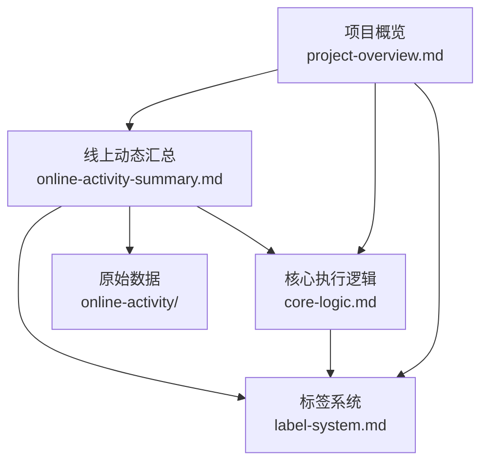

# GitHub Harness 项目分析文档

> 本目录包含对 [`kun-content-lab/github-harness-programming-resources`](https://github.com/kun-content-lab/github-harness-programming-resources) 仓库的全面分析与文档化成果。
>
> 分析工具:GitHub CLI(`gh cli`) · 数据采集时间:2026-07-12 · 文档语言:中文

---

## 文档索引

| 文档 | 内容 | 适用读者 |
|---|---|---|
| [项目概览](project-overview.md) | 仓库元信息、用途、目录结构、技术栈、关键特性、快速开始 | 首次接触项目者 |
| [核心执行逻辑分析](core-logic.md) | 核心循环、五大表面、三层 issue 体系、三个 workflow、两个 Skill、数据流、活体闭环 | 想理解"怎么做"者 |
| [标签系统深入分析](label-system.md) | 标签定义、分类体系、应用规则、在执行流程中的作用、控制面保护机制 | 想理解标签设计者 |
| [线上动态汇总](online-activity-summary.md) | Issues/PRs/Discussions/Labels 数据汇总、活体闭环验证、综合观察 | 想了解项目现状者 |
| [使用示例](usage-examples.md) | 手把手操作指南:从复制文件到跑通完整闭环的七大步骤、注意事项与 FAQ | 想动手实操者 |
| [对比说明](openspec-comparison.md) | OpenSpec 与 GitHub Harness 的功能、架构、接口、性能、使用场景横向对比 | 想做选型或横向对比者 |

## 原始数据

线上动态的原始数据保存在 [`online-activity/`](online-activity/) 目录:

| 文件 | 内容 |
|---|---|
| [repo-meta.json](online-activity/repo-meta.json) | 仓库元信息(名称、描述、默认分支、语言、时间戳等) |
| [issues.json](online-activity/issues.json) | 全部 Issues(9 个,含标题、状态、标签、作者、正文) |
| [pull-requests.json](online-activity/pull-requests.json) | 全部 Pull Requests(5 个,含标题、状态、关联文件、合并时间) |
| [discussions.json](online-activity/discussions.json) | Discussions 查询结果(已启用,内容为空) |
| [labels.json](online-activity/labels.json) | 全部 Labels(17 个:9 默认 + 8 自定义) |

## 项目一句话概述

`github-harness-programming-resources` 是一个**可以直接拿走用的 GitHub Harness starter kit**——把 GitHub 当作 AI 工作的控制面,让 Discussion → Issue → PR / evidence comment → review 的活体闭环可以跑通。

## 核心发现

1. **三层 issue 体系已落地**: `truth-source`(#1 PRD)→ `parent-task`(#2 Epic)→ `sub-task`(#3-#8)的控制面结构
2. **活体闭环验证通过**: 5 个 PR 全部 MERGED,对应 sub-task 全部 CLOSED,自动关闭机制有效
3. **truth-source 守护有效**: #1 PRD 在所有下游关闭后仍保持 OPEN
4. **标签系统设计精巧**: 8 个自定义标签 + 双重守护机制(标签守护 + Refs 不匹配)
5. **模型无关设计**: 不绑定特定 AI 模型,可自由配置

## 文档关系

## 如何使用本文档

- **初次了解项目**:从 [项目概览](project-overview.md) 开始
- **想动手实操**:从 [使用示例](usage-examples.md) 开始,照着跑通完整闭环
- **理解工作原理**:阅读 [核心执行逻辑分析](core-logic.md)
- **理解标签设计**:阅读 [标签系统深入分析](label-system.md)
- **查看项目现状**:阅读 [线上动态汇总](online-activity-summary.md)
- **查阅原始数据**:访问 [online-activity/](online-activity/) 目录
- **想做横向对比/选型**:阅读 [对比说明](openspec-comparison.md),对比 OpenSpec 与 GitHub Harness

---

*本文档由 GitHub CLI 采集与分析工具自动生成,数据来源:仓库克隆副本与线上 API。*
