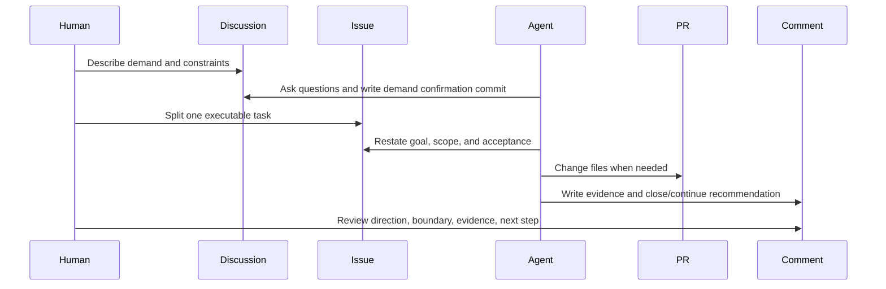
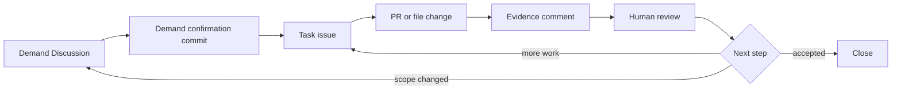
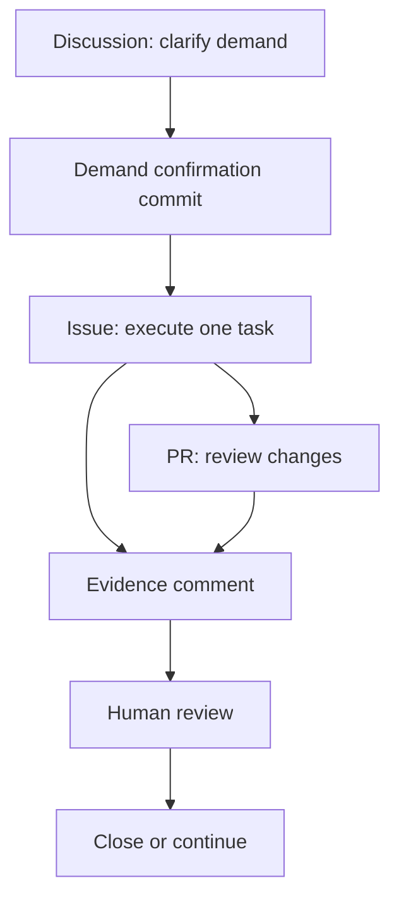
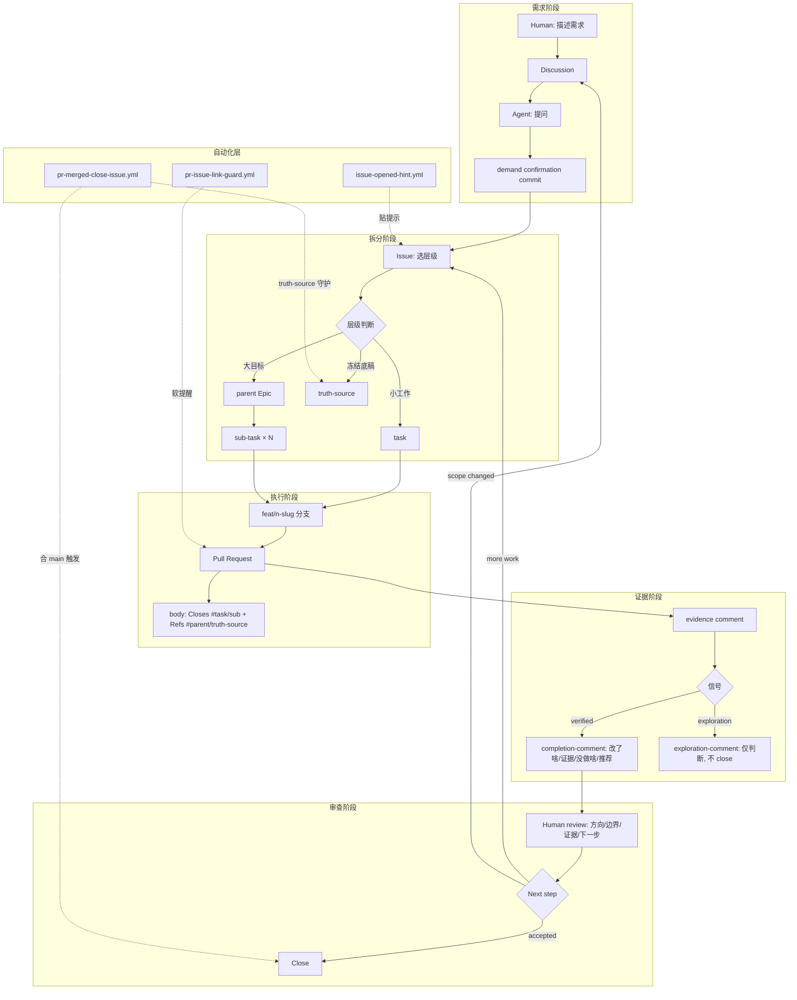
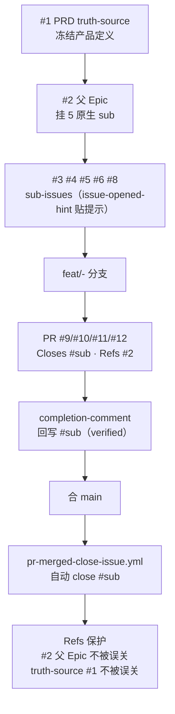

# GitHub Harness 核心执行逻辑分析

> 本文档深入分析 `github-harness-programming-resources` 仓库的核心执行逻辑：它如何把 GitHub 当作 AI 工作的控制面，如何用 Discussion → Issue → PR → Evidence Comment → Review 的闭环推进项目，以及三个自动化 workflow 与两个 Skill 文件如何共同维持纪律。
>
> 文档中引用代码文件时，路径均相对于仓库根目录 `github-harness-programming-resources/`。

---

## 1. 标题与概述

`github-harness-programming-resources` 是一个"可以直接拿走用的 GitHub Harness starter kit"。它不是框架，也不是运行时——它是一套**可复制的 Agent 工作控制面**：项目提示词、Skill、GitHub templates、workflow、checklist 和 demo。复制到自己仓库后，就可以让 AI agent 按 Discussion → Issue → PR / evidence comment → review 的方式推进项目。

核心执行逻辑可以浓缩成一句话：

> **AI agent 不只在聊天里工作，而是针对持久的 GitHub 表面（surface）工作。每个需求、任务、证据、决策都有它该去的地方。**

这套逻辑由三层组件协同实现：

| 层 | 组件 | 职责 |
|---|---|---|
| 约定层 | `prompts/` + `skills/` + `templates/` + `docs/` | 定义 agent 该怎么想、怎么写、怎么走流程 |
| 模板层 | `.github/ISSUE_TEMPLATE/` + `.github/COMMENT_TEMPLATE/` + `.github/PULL_REQUEST_TEMPLATE.md` | 让每个 GitHub 表面有结构化的填写骨架 |
| 自动化层 | `.github/workflows/` 三个 workflow | 用代码强制执行链接纪律、truth-source 守护、自动关闭与软提醒 |

这三层合在一起，构成一个**能自我验证、能防止误操作、能被人类审查**的工作闭环。仓库自己用这套跑过一遍（living loop），产出了真实的 issue #1~#8 与 PR #9~#13，本仓即其产物。

---

## 2. 核心理念：GitHub 作为 AI 工作控制面

### 2.1 问题：长 AI 工作为什么失败

长 AI 工作失败，往往是因为**所有状态都留在聊天里**。一旦对话变长，agent 就会丢失三件事之间的关系：

1. 当前任务与之前决策的关系；
2. 当前任务与已有证据的关系；
3. 当前任务与人类审查期待的关系。

聊天是易失的、线性的、无结构的。它没有"这个地方放需求""那个地方放证据"的稳定锚点。

### 2.2 解法：把工作钉在持久的 GitHub 表面上

GitHub Harness 的核心理念（见 `docs/how-it-works.md`）是：

> **GitHub 作为 AI 工作的控制面（control plane）。AI agent 不是只和人聊天，而是针对持久的 GitHub 表面工作。**

每个 GitHub 表面（Discussion / Issue / PR / Comment / Board）都有**一个职责**。工作流之所以变乱，往往是因为一个表面试图承担所有职责（比如用 Issue 聊需求、又在同一个 Issue 里塞证据、又用 PR 评论讨论方向）。

GitHub 给每部分工作一个稳定的位置：

| 需求 | GitHub 表面 |
|---|---|
| 澄清需求 | Discussion |
| 执行一个任务 | Issue |
| 审查文件变更 | Pull Request |
| 记录证据 | Comment |
| 跟踪多任务 | Project board |

### 2.3 关键：agent 永远知道四件事

`docs/how-it-works.md` 强调，重要的不是记住 GitHub 的功能，而是构建一个系统，让 agent 始终知道：

1. **需求从哪来**（源头可追溯）；
2. **当前任务边界是什么**（不会越界）；
3. **必须产出什么证据**（不能空口说完成）；
4. **人类会审查什么**（方向、边界、证据、下一步）。

这四点贯穿了后面所有的设计：Issue 模板里强制写 source / scope / acceptance / evidence requirement；Skill 里强制"完成前必须写 evidence comment"；workflow 里强制"PR 必须挂在 issue 上"。

### 2.4 最小可用形态

最小可用的 Harness 是（见 `docs/how-it-works.md`）：

```text
Demand Discussion -> Task issue -> Evidence comment
```

Discussion 确认需求，Issue 收窄执行，Evidence comment 让完成可审查。等这个闭环稳定后，再叠加 PR 模板、board、labels、自动化。这一"先最小闭环、再按需扩展"的思路也体现在 `docs/adoption-guide.md` 的 Step 5："Add a board only when there are multiple issues. Add automation only after the manual loop is clear."

---

## 3. 核心循环（Core Loop）

### 3.1 七步执行流程

核心循环把一次完整的工作划分成七步，每一步都对应一个 GitHub 表面与一个动作主体（见 `docs/how-it-works.md` 与 `README.md`）：

1. **人描述需求和约束**（Discussion）
2. **Agent 提问并写 demand confirmation commit**（Discussion）
3. **人拆分一个可执行任务**（Issue）
4. **Agent 重述目标、范围和验收标准**（Issue）
5. **Agent 在需要时变更文件**（PR）
6. **Agent 写证据和 close/continue 推荐**（Comment）
7. **人审查方向、边界、证据、下一步**（Comment）

### 3.2 时序图

来自 `docs/how-it-works.md`：



### 3.3 分支决策图

来自 `README.md` 与 `diagrams/minimum-harness-engine.mmd`，刻画了"下一步"的分支：



关键在于三条回流路径：

- **accepted → Close**：验收达成，证据可审，关闭当前 issue。
- **more work → Task issue**：同一个 issue 还需要继续，回不到 Discussion。
- **scope changed → Demand Discussion**：范围变了，必须回 Discussion 重新对齐，**不能在执行型 issue 里偷偷改方向**。

这条"scope changed 必须回流 Discussion"的纪律，在 `skills/github-harness-workflow/SKILL.md` 的 Execute one task 步骤里被再次强调："If scope changes, stop and return to Discussion or split a new issue."

### 3.4 推荐流向图

来自 `docs/surface-map.md`，给出了更细的流向，注意 PR 与 Evidence comment 是并行从 Issue 出发的：



---

## 4. 五大 GitHub 表面（Surface）

每个表面有且仅有一个职责（见 `docs/surface-map.md`）。当一个表面试图做所有事，工作流就会变乱。

| Surface | 职责 | 良好产出 |
|---|---|---|
| Discussion | 需求确认与开放问题 | 一段 demand confirmation commit |
| Issue | 一个可执行任务 | 目标、范围、验收、证据要求；分三层 |
| Pull Request | 审查文件变更 | 变更地图、风险、验证 |
| Comment | 证据、决策、下一步 | 两种信号：completion / exploration |
| Project board | 多任务状态 | 有序工作、当前状态、阻塞项 |

### 4.1 Discussion：明确需求

Discussion 只聊需求，不干活。它的产出是一段 **demand confirmation commit**，把模糊需求冻结成可追溯的确认，作为拆 issue 的依据。

`.github/DISCUSSION_TEMPLATE/demand-confirmation.md` 规定了 Discussion 的结构：

- 原始需求（Raw Demand）
- 目标用户（Target User）
- 第一版目标（First Version Goal）
- 范围边界（In scope / Out of scope）
- 验收标准（Acceptance Standard）
- 开放问题（Open Questions）
- Demand Confirmation Commit（结尾由 AI 写）

模板明确警告边界：

> ⚠️ **边界**：Discussion 不是执行任务。确认后拆成 task issue 再领，别在本 Discussion 直接开工。

### 4.2 Issue：定义可执行任务

Issue 是执行单元。它必须包含：source（来源 Discussion 或决策）、goal、scope、out of scope、acceptance criteria、evidence requirement、close condition。Issue 有三层结构（见第 5 节）。

### 4.3 Pull Request：审查具体文件变更

PR 只管"改了哪些文件、为什么改、怎么验证、审查重点"。`.github/PULL_REQUEST_TEMPLATE.md` 与 `templates/pr-description.md` 规定其结构：

- Status（`ready-for-review` / `partial` / `blocked`）
- One-Sentence Result
- Source Issue（`Closes #` 执行型 / `Refs #` 控制面）
- Change Map（表格：Area / What changed / Why）
- Verification（表格：Check / Result / Evidence）
- Review Focus（4 个 checkbox）
- Risks / Boundaries

PR 模板顶部明确写链接纪律：

> Link discipline: `Closes #<task/sub>` for execution issues (auto-closes on merge to main); `Refs #<parent/truth-source>` for control surfaces — never `Closes` a parent or truth-source (prevents auto-closing the control plane).

### 4.4 Comment：记录决策、证据和下一步

Comment 是"证据层"，分两种信号（见 `.github/COMMENT_TEMPLATE/`）：

- **completion-comment**（`verified`）：任务完成、可关闭。必填：完成了什么、证据在哪、没做什么、是否可关闭的推荐。
- **exploration-comment**（`exploration`）：仅记录判断，**不代表任务完成，不关闭任何东西**。必填：确认了什么、为什么重要、影响哪里。

这两种信号的区分至关重要：`exploration` 让 agent 可以"留下思考痕迹"而不触发关闭流程，避免"探索性结论被误当完成"。

### 4.5 Project board：多任务协调

Board 只在项目增长、出现多个 issue 时才加入。`docs/adoption-guide.md` Step 5："Add a board only when there are multiple issues."它的产出是有序工作、当前状态、阻塞项。

---

## 5. 三层 Issue 体系

Issue 不是扁平的"任务列表"，而是分四类（其中三类是"执行型/控制面型"，加上一类冻结底稿）。这四类构成了 GitHub Harness 的层级骨架（见 `skills/github-harness-workflow/SKILL.md` 与 `docs/surface-map.md`）。

| 层级 | 标签 | 用途 | PR 链接动词 | 是否自动 close |
|---|---|---|---|---|
| `task` | `task` | 一个可执行单元，默认用于小工作 | `Closes #task` | 是 |
| `parent` Epic | `parent-task` | 大目标的控制面入口，挂原生 sub-issue，进度自动汇总 0/N | `Refs #parent` | 否（控制面） |
| `sub-task` | `sub-task` | 父 Epic 下可执行切片 | `Closes #sub` | 是 |
| `truth-source` | `truth-source` + `frozen` | 冻结常驻底稿（产品/契约/架构/计划） | `Refs #truth-source` | 否（冻结守护） |

### 5.1 task：可执行单元

`.github/ISSUE_TEMPLATE/task.md` 定义 task 为"可领取的执行单元 · 跑内环（分支→PR→合 main→自动 close）"。它跑完整内环闭环：建 `feat/<n>-<slug>` 分支 → PR 写 `Closes #task` → 合 main → 自动 close → 保留分支。

task 模板强调"最小竖切（一条分支装得下）"和"成功标准（机械可验）"，并要求写 **deletion-spec（拆除说明）**——这次新增的东西将来怎么删/回滚。Close Condition 明确：

> ⚠️ 验收标准达成 + 证据 comment 已回写并经人审，才可关闭。

### 5.2 parent Epic：控制面入口

`.github/ISSUE_TEMPLATE/parent-task.md` 定义 parent Epic 为"大目标的控制面入口 · 挂原生子议题追踪进度 · 默认 Refs 不 Closes"。它**自己不干活**，靠子议题推进。

关键设计：子任务挂成**原生 sub-issue**（GitHub 自带的父子关系，进度自动汇总 0/N），而不是用游离 checklist 模拟层级。模板里反复强调：

> 挂原生父子关系：在本 issue 页面底部「Sub-issues → Add sub-issue」，别用游离 checklist 模拟层级。

parent Epic 用 `Refs` 不用 `Closes`，防止 PR 合并误关控制面。`skills/github-harness-workflow/SKILL.md` 的 Do Not 列表明确禁止：

> Use a loose checklist to fake parent/child hierarchy — use native sub-issues so progress sums automatically.

### 5.3 sub-task：父 Epic 下切片

`.github/ISSUE_TEMPLATE/sub-task.md` 定义 sub-task 为"父 Epic 下可领取的执行单元 · 跑内环 · 完成 Closes"。它和 task 一样跑内环，区别只在于它挂在一个 parent Epic 下，完成后让父进度 +1。PR 用 `Closes #sub`。

### 5.4 truth-source：冻结常驻底稿

`.github/ISSUE_TEMPLATE/truth-source.md` 定义 truth-source 为"冻结的常驻底稿（产品/契约/架构/计划）· 不跑内环、不被自动关"。这是整个体系里**最受保护**的一类。

它的核心规则：

- **永不进入领取→关闭循环**——不可领取、不可建 feat 分支、不可被自动关闭。
- **修改门禁**：只有两种情况才走"反向通道"改：① 需求变了 ② 工程撞到实际问题。日常干活请去对应的 `task` issue。
- **自动化守护**：带 `truth-source` 标签的 issue，`issue-opened-hint` workflow 贴「冻结勿领取」提示；`pr-merged-close-issue` workflow 即使 PR body 误写 `Closes #本issue` 也**不会自动关**。

truth-source 的链条位置是：产品定义 → 契约 → 架构 → 项目计划 →（拆出）任务。每一层 truth-source 都可以挂上游依据和下游拆出的任务。

### 5.5 为什么不用扁平 issue 列表

三层体系解决了三个问题：

1. **粒度失控**：所有事都是 task，分不清"一个小改动"和"一个跨周大目标"。parent Epic + sub-task 让大目标可追踪、小切片可执行。
2. **控制面被误关**：如果没有 Refs/Closes 区分，一个 PR 合并就可能把"产品方向"issue 也关掉。链接纪律（见第 6 节）解决。
3. **真理源被污染**：如果没有 truth-source 冻结，产品定义会被日常改动反复改写，失去"定下不随便动"的锚点作用。

---

## 6. 链接纪律（Closes vs Refs）

链接纪律是这套体系里**最硬的工程约束**，它决定了 PR 合并时哪些 issue 会被自动关闭、哪些会被保护。

### 6.1 两条规则

| PR 使用 | 效果 | 何时用 |
|---|---|---|
| `Closes #<task/sub>` | 合并到 `main` 时自动关闭 issue | 执行型 task / sub-task |
| `Refs #<parent/truth-source>` | 只关联，永不关闭 | 父 Epic / truth-source 控制面 |

### 6.2 为什么 Refs 不能写成 Closes

如果父 Epic 或 truth-source 被误写 `Closes`，PR 合并时它们就会被自动关闭，导致：

- 父 Epic 还挂着其他未完成 sub-task 就被关了，进度汇总失效；
- truth-source（产品定义/契约/架构）被关后，下游任务失去冻结锚点。

因此 `skills/github-harness-workflow/SKILL.md` 的 Do Not 明确写：

> Use `Closes #<parent>` or `Closes #<truth-source>` in a PR — use `Refs` instead; control surfaces must not be auto-closed.
>
> Claim a `truth-source` issue or build a feat branch off it — it is frozen; daily work goes to the matching `task` issue.

### 6.3 双重保护机制

链接纪律由两层保护：

1. **正则不匹配 Refs**：`pr-merged-close-issue.yml` 的正则只匹配 `Closes/Fixes/Resolves`（含中文"关闭/修复/解决"），**刻意不匹配 Refs**。所以 PR body 里 `Refs #2`（父 Epic）永远不会被自动关闭。
2. **truth-source 标签守护**：即便 PR body 误写 `Closes #1`（truth-source），workflow 也会检查 issue 的 labels，遇到 `truth-source` 标签就跳过并留言，不关闭。

这两层保护在 `docs/surface-map.md` 里被总结：

> The `pr-merged-close-issue.yml` workflow matches `Closes/Fixes/Resolves` (and Chinese 关闭/修复/解决) but **not** `Refs`, so control planes are never auto-closed. `truth-source` issues are guarded even if a PR body mis-writes `Closes`.

### 6.4 速查表

来自 `examples/living-loop-walkthrough.md`：

| 层 / 信号 | 标签 | PR 链接动词 | 是否自动 close |
|---|---|---|---|
| `task` | task | `Closes` | 是 |
| `sub-task` | sub-task | `Closes` | 是 |
| `parent` Epic | parent-task | `Refs` | 否（控制面） |
| `truth-source` | truth-source + frozen | `Refs` | 否（冻结守护） |
| `completion-comment` | — | — | 证据回写（verified） |
| `exploration-comment` | — | — | 仅记录判断（exploration，不 close） |

---

## 7. 三个自动化 Workflow

三个 workflow 位于 `.github/workflows/`，是链接纪律与 truth-source 守护的**代码强制层**。它们都用 `deletion-spec` 注释标明"存在理由"与"禁用方式"——删除 `.yml` 即可禁用，项目级隔离，无下游依赖。

### 7.1 issue-opened-hint.yml：领取提示与 truth-source 冻结提示

**文件**：`.github/workflows/issue-opened-hint.yml`

**触发**：issue 打开时（`issues: [opened]`）。

**权限**：`issues: write`。

**作用**：

- 对普通 issue 贴分支命名提示，降低领取时的纪律负担。
- 对带 `truth-source` 标签的 issue 改贴「冻结勿领取」提示，不误导成可领取任务。

**关键逻辑**：先检查 issue 的 labels，如果是 truth-source 则贴冻结提示并退出；否则贴领取提示。

**关键代码**：

```yaml
on:
  issues:
    types: [opened]

permissions:
  issues: write

jobs:
  hint-branch-naming:
    runs-on: ubuntu-latest
    steps:
      - name: Comment branch-naming hint
        env:
          GH_TOKEN: ${{ secrets.GITHUB_TOKEN }}
          REPO: ${{ github.repository }}
          ISSUE_NUMBER: ${{ github.event.issue.number }}
        run: |
          set -euo pipefail
          # 真理源守护：带 truth-source label 的 issue 是冻结真理源，不可领取——贴冻结提示而非领取提示
          LABELS=$(gh issue view "${ISSUE_NUMBER}" --repo "${REPO}" --json labels --jq '.labels[].name' 2>/dev/null || echo "")
          if printf '%s\n' "${LABELS}" | grep -qx "truth-source"; then
            gh issue comment "${ISSUE_NUMBER}" --repo "${REPO}" \
              --body "🔒 内环提示：本 issue 是【真理源】(truth-source)，**冻结常驻、不可领取、不进领取→关闭循环**。改它只走反向通道（需求变 / 工程撞墙）；日常干活请去对应的 \`task\` issue。"
            echo "真理源 #${ISSUE_NUMBER}：贴冻结提示（跳过领取提示）"
            exit 0
          fi
          gh issue comment "${ISSUE_NUMBER}" --repo "${REPO}" \
            --body "🤖 内环提示：领取本 issue 请建分支 \`feat/${ISSUE_NUMBER}-<slug>\`，PR 目标 \`main\`，body 写 \`Closes #${ISSUE_NUMBER}\`。合并后自动 close 本 issue 并保留分支。"
```

**设计要点**：

- 用 `gh issue view --json labels --jq` 拿到 issue 的标签列表。
- 用 `grep -qx "truth-source"` 精确整行匹配（`-x` 表示整行匹配，避免子串误命中）。
- truth-source 分支 `exit 0` 提前退出，**不贴领取提示**。
- 普通分支贴的提示已经把整套内环纪律压缩进一条消息：分支命名、PR 目标 main、body 写 Closes、合并自动 close、保留分支。

**deletion-spec 注释**指出本 workflow 不参与 close：

> 本仓库内环合 main（默认分支），GitHub 原生 Closes #n 在合 main 时即自动 close issue，故本 workflow 只负责「贴提示」与「truth-source 守护」，不参与 close。

### 7.2 pr-merged-close-issue.yml：自动关闭 + Refs 保护 + truth-source 守护

**文件**：`.github/workflows/pr-merged-close-issue.yml`

**触发**：PR 关闭时（`pull_request: [closed]`），但仅当 `merged == true` 才执行 job。关闭但未合并不处理。

**权限**：`issues: write`、`contents: read`、`pull-requests: read`。

**作用**：

- 解析 PR body 中的关闭引用：英文 `Closes/Fixes/Resolves` + 中文"关闭/修复/解决"。
- **刻意不匹配 Refs**——保护控制面（父 Epic / truth-source）不被误关。
- truth-source 守护：即使 PR body 误写 `Closes #truth-source`，也跳过并留言。
- 显式保留分支（留分支纪律）。
- 留 close 归还 comment（在被关闭的 issue 上留言说明由哪个 PR 关闭）。

**关键代码（Python 正则解析）**：

```yaml
on:
  pull_request:
    types: [closed]

permissions:
  issues: write
  contents: read
  pull-requests: read

jobs:
  close-referenced-issues:
    if: github.event.pull_request.merged == true
    runs-on: ubuntu-latest
    steps:
      - name: Close referenced issues, keep branch
        env:
          GH_TOKEN: ${{ secrets.GITHUB_TOKEN }}
          REPO: ${{ github.repository }}
          PR_NUMBER: ${{ github.event.pull_request.number }}
          PR_BASE: ${{ github.event.pull_request.base.ref }}
          PR_BODY: ${{ github.event.pull_request.body }}
        run: |
          set -euo pipefail
          echo "PR #${PR_NUMBER} merged into ${PR_BASE}"

          # 解析 body 中的关闭引用：英文 Closes/Fixes/Resolves + 中文 关闭/修复/解决，后接 #数字
          # 注意：刻意不匹配 Refs —— Refs 只关联不关闭（父 Epic / 真理源保护）
          NUMS=$(python3 <<'PY'
          import os, re
          body = os.environ.get("PR_BODY", "") or ""
          pat = re.compile(
              r'(?:close[sd]?|fix(?:e[sd])?|resolve[sd]?|关闭|修复|解决)\s*[:：]?\s*#(\d+)',
              re.IGNORECASE,
          )
          print(" ".join(sorted(set(pat.findall(body)), key=int)))
          PY
          )
```

**正则分析**：

```
(?:close[sd]?|fix(?:e[sd])?|resolve[sd]?|关闭|修复|解决)\s*[:：]?\s*#(\d+)
```

- `close[sd]?`：匹配 close / closes / closed。
- `fix(?:e[sd])?`：匹配 fix / fixes / fixed。
- `resolve[sd]?`：匹配 resolve / resolves / resolved。
- `关闭|修复|解决`：中文关闭词。
- `\s*[:：]?\s*`：可选的空格 + 可选的中英文冒号 + 可选的空格，兼容 `Closes #1`、`Closes:#1`、`关闭：#1` 等写法。
- `#(\d+)`：issue 编号，捕获到 group 1。
- `re.IGNORECASE`：大小写不敏感。
- `set(pat.findall(body))` 去重，`key=int` 按数字排序。

**注意**：正则**不包含 `refs?`**，这是刻意的——Refs 只关联不关闭。

**逐个 issue 处理逻辑**：

```bash
for n in ${NUMS}; do
  # 真理源守护：带 truth-source label 的 issue 是冻结真理源，永不自动 close
  LABELS=$(gh issue view "${n}" --repo "${REPO}" --json labels --jq '.labels[].name' 2>/dev/null || echo "")
  if printf '%s\n' "${LABELS}" | grep -qx "truth-source"; then
    gh issue comment "${n}" --repo "${REPO}" \
      --body "🔒 #${n} 是【真理源】(truth-source)，按内环纪律【不自动关闭】。PR #${PR_NUMBER} 仅与之关联。改真理源请走反向通道（需求变 / 工程撞墙）。"
    echo "跳过 #${n}（truth-source 真理源守护生效）"
    continue
  fi
  STATE=$(gh issue view "${n}" --repo "${REPO}" --json state --jq .state 2>/dev/null || echo "MISSING")
  if [ "${STATE}" = "OPEN" ]; then
    gh issue comment "${n}" --repo "${REPO}" \
      --body "由 PR #${PR_NUMBER} 合并进 \`${PR_BASE}\` 自动关闭（归还）。按内环纪律【保留】分支。"
    gh issue close "${n}" --repo "${REPO}" --reason completed
    echo "已自动 close #${n}"
  else
    echo "跳过 #${n}（state=${STATE}，非 OPEN）"
  fi
done
```

**设计要点**：

1. **truth-source 守护在前**：先查 labels，truth-source 跳过并留言，不进入关闭流程。
2. **state 检查**：只关 OPEN 状态的 issue，避免重复关闭已关闭的。
3. **留 close 归还 comment**：关闭前在 issue 上留言"由 PR #n 合并进 main 自动关闭（归还）。按内环纪律【保留】分支。"
4. **不删除分支**：脚本结尾 `echo "完成。本 workflow 不删除任何分支（留分支纪律）。"`

**为什么需要这个 workflow（deletion-spec 注释）**：

GitHub 原生 `Closes #n` 在合默认分支时本就会自动 close issue，但有两个缺口：

1. 只认英文 `Closes/Fixes/Resolves`，不认中文"关闭/修复/解决"；
2. 不区分 truth-source，会误关冻结真理源。

本 workflow 补上：中文 PR body 兼容 + truth-source 守护 + 显式保留分支 + 留 close 归还 comment。

**纪律修正**：只 close `Closes/Fixes/Resolves/关闭/修复/解决`，**不 close Refs**——父 Epic / 真理源用 Refs 关联，绝不被本 workflow 误关控制面。

### 7.3 pr-issue-link-guard.yml：PR 缺链接软提醒

**文件**：`.github/workflows/pr-issue-link-guard.yml`

**触发**：PR 打开或编辑时（`pull_request: [opened, edited]`）。

**权限**：`pull-requests: write`。

**作用**：检查 PR body 是否有 `Closes/Refs` 关联 issue；缺了就评论软提醒（**不阻断合并**），呼应内环"每个 PR 都要挂在 issue 上"的纪律。

**关键代码**：

```yaml
on:
  pull_request:
    types: [opened, edited]

permissions:
  pull-requests: write

jobs:
  link-guard:
    runs-on: ubuntu-latest
    steps:
      - name: Check PR body for issue link
        env:
          GH_TOKEN: ${{ secrets.GITHUB_TOKEN }}
          REPO: ${{ github.repository }}
          PR_NUMBER: ${{ github.event.pull_request.number }}
          PR_BODY: ${{ github.event.pull_request.body }}
        run: |
          set -euo pipefail
          if printf '%s' "${PR_BODY}" | grep -Eqi '(close[sd]?|fix(?:e[sd])?|resolve[sd]?|refs?|关闭|修复|解决)\s*[:：]?\s*#[0-9]+'; then
            echo "PR body 含 issue 关联，OK。"
            exit 0
          fi
          gh pr comment "${PR_NUMBER}" --repo "${REPO}" \
            --body "⚠️ 软提醒（不阻断合并）：本 PR body 没有写 \`Closes #<issue>\` 或 \`Refs #<issue>\`。内环要求每个 PR 挂在 issue 上：执行型用 Closes，父 Epic / 真理源用 Refs。"
```

**正则分析**：

```
(close[sd]?|fix(?:e[sd])?|resolve[sd]?|refs?|关闭|修复|解决)\s*[:：]?\s*#[0-9]+
```

- 与 `pr-merged-close-issue.yml` 的正则相比，**多了 `refs?`**（匹配 ref / refs）。
- 这是因为 guard 的职责是"有没有挂 issue"，**Closes 和 Refs 都算挂上了**；而 close workflow 的职责是"关哪些"，**只有 Closes 类才关**。
- `grep -Eqi`：`-E` 扩展正则、`-q` 安静模式、`-i` 忽略大小写。

**设计要点**：

- **软提醒不阻断**：用评论而非 status check，不卡合并流程。
- **opened + edited 都触发**：PR 后补链接也会被识别为 OK。

### 7.4 三个 workflow 的职责对照

| Workflow | 触发 | 职责 | 是否阻断 |
|---|---|---|---|
| `issue-opened-hint.yml` | issue opened | 贴领取提示 / truth-source 贴冻结提示 | 否（仅评论） |
| `pr-merged-close-issue.yml` | PR closed + merged | 解析 Closes 关闭 issue；truth-source 守护；保留分支 | 否（仅关闭 issue） |
| `pr-issue-link-guard.yml` | PR opened/edited | 检查 Closes/Refs 是否存在，缺则软提醒 | 否（仅评论） |

三者共同形成"**提示 → 守护 → 关闭**"的完整链条，且全部是软约束（评论、关闭 issue），不阻断任何人类操作。

---

## 8. 两个 Skill 文件（AI agent 行为规范）

两个 Skill 文件位于 `skills/`，定义了 AI agent 的"工作流程规范"与"写作规范"。它们是 agent 行为的约定层。

### 8.1 github-harness-workflow/SKILL.md：工作流程规范

**文件**：`skills/github-harness-workflow/SKILL.md`

**描述**：Use when planning, executing, or reviewing work through GitHub Discussion, issue, PR, and evidence comments.

**何时使用**：

- 开始新项目任务；
- 把松散请求变成工作；
- 把 Discussion 拆成 issue；
- 完成 issue；
- 决定关闭还是继续。

**六步 Flow**：

1. **Locate the source（定位来源）**
   - 有 Discussion 先读 Discussion；
   - 有 issue 读其 goal / scope / acceptance / comments；
   - 没有持久源，要求创建 demand Discussion 或 task issue。

2. **Confirm the demand（确认需求）**
   - 识别 target user / first version goal / in scope / out of scope / acceptance / open questions；
   - 在 Discussion 里工作时，写 demand confirmation commit。

3. **Split execution（拆分执行）**
   - 把确认的需求转成一个或多个 task issue；
   - 每个 issue 必须可执行、可审查；
   - 按大小选层级：task / parent Epic / sub-task / truth-source。

4. **Execute one task（执行一个任务）**
   - 只在 issue 范围内工作；
   - 范围变了，停下回 Discussion 或拆新 issue；
   - 分支命名 `feat/<issue>-<slug>`，PR 目标 main，body 用 `Closes #<task/sub>`（执行型）/ `Refs #<parent/truth-source>`（控制面），**永不在 parent 或 truth-source 上用 Closes**。

5. **Provide evidence（提供证据）**
   - 写 evidence comment：
     - `completion-comment`（`verified`）：任务完成、可关闭——改了啥、在哪审、没做啥、推荐。
     - `exploration-comment`（`exploration`）：仅记录判断，不是完成，不关闭任何东西。
   - 包含变更文件、PR、截图、命令输出或链接。

6. **Recommend next step（推荐下一步）**
   - `close`：验收达成、证据可审。
   - `continue`：同一 issue 需要更多工作。
   - `split`：需要新任务。
   - `return-to-discussion`：需求变了。

**Output Contract**：每个工作周期应留下以下之一：demand confirmation commit、task issue、PR description、evidence comment、review checklist result。

**Do Not（禁止项）**：

- 没有持久源时从模糊聊天请求开始实现；
- 没有证据就关闭 issue；
- 把 Discussion 当执行任务；
- 把缺失需求藏进自信的总结里；
- 在 PR 里用 `Closes #<parent>` 或 `Closes #<truth-source>`——用 `Refs`；控制面不能被自动关闭；
- 领取 truth-source issue 或在其上建 feat 分支——它是冻结的；日常干活去对应的 task issue；
- 用游离 checklist 假装父子层级——用原生 sub-issue 让进度自动汇总。

### 8.2 github-cognitive-surface-lite/SKILL.md：写作规范

**文件**：`skills/github-cognitive-surface-lite/SKILL.md`

**描述**：Use when writing readable GitHub Discussions, issues, PR descriptions, review comments, or evidence comments.

**核心理念**：让人类不用读完整聊天记录就能审查 GitHub 表面。

**Core Shape（核心顺序）**：

1. Status（状态）
2. One-sentence result（一句话结果）
3. Context or relationship map（上下文/关系图）
4. Human-readable content（人话内容）
5. Evidence（证据）
6. Boundary and risk（边界/风险）
7. Recommended next step（推荐下一步）
8. Technical details in a collapsed section if needed（技术细节，折叠）

这个顺序的核心是"**人话在前，机器在后**"——把人类可读的摘要放最前，把机器细节放后面甚至折叠。

**各表面必填字段**：

- **Discussion**：为何存在、目标用户/owner、in scope、out of scope、open questions、demand confirmation commit。
- **Issue**：source Discussion 或决策、goal、scope、out of scope、acceptance criteria、evidence requirement、close condition。按大小分层：task / parent Epic / sub-task / truth-source。
- **PR**：what changed、why、files or surfaces affected、verification、review focus、linked issue。
- **Evidence Comment**：status（ready/partial/blocked）、completed items、evidence links or file paths、not done、risks、recommendation（close/continue/split/return to Discussion）。两种信号：completion-comment（verified）/ exploration-comment（exploration）。

**Writing Rules**：

- 人话摘要放最前；
- 机器细节放后面；
- 不堆原始日志除非需要；
- 不写"done"而没有证据。

### 8.3 两个 Skill 的分工

| Skill | 管什么 | 关键产出 |
|---|---|---|
| `github-harness-workflow` | 流程：何时做啥、走哪个表面、如何拆分、如何推荐下一步 | 每周期留下 demand commit / issue / PR / evidence / checklist 之一 |
| `github-cognitive-surface-lite` | 写作：每个表面怎么写、字段必填、顺序如何 | 人可读的、结构化的、证据齐全的表面内容 |

一个管"做什么"，一个管"怎么写"。两者配合，让 agent 既走对流程，又留下可审查的痕迹。

---

## 9. 数据流向：从需求到交付的完整数据流

这一节把前面所有组件串成一条完整的数据流，刻画"一个需求从被提出到被关闭"的全过程。

### 9.1 完整数据流图



### 9.2 数据流的文字描述

1. **需求阶段**：人在 Discussion 描述需求与约束；Agent 提问补全开放问题；Discussion 结尾由 Agent 写一段 demand confirmation commit（包含 target user / first version goal / in scope / out of scope / acceptance / open questions / suggested issues）。这段 commit 是后续拆 issue 的**唯一合法依据**。

2. **拆分阶段**：把 demand commit 拆成 issue，按大小选层级——小工作用 task；大目标用 parent Epic 挂原生 sub-issue；冻结底稿用 truth-source。`issue-opened-hint.yml` 在 issue 打开时自动贴提示：普通 issue 贴分支命名提示，truth-source 贴冻结提示。

3. **执行阶段**：领取 task 或 sub-task，建 `feat/<n>-<slug>` 分支，改文件，开 PR。PR body 必须写链接：执行型 `Closes #<task/sub>`，控制面 `Refs #<parent/truth-source>`。`pr-issue-link-guard.yml` 在 PR 打开/编辑时检查 body 有没有 Closes/Refs，缺了软提醒（不阻断）。

4. **证据阶段**：Agent 写 evidence comment。完成的写 completion-comment（`verified`），包含改了啥、证据在哪、没做啥、推荐；只记录判断的写 exploration-comment（`exploration`），不关闭任何东西。

5. **审查阶段**：人审查四件事——方向（是否仍解决确认的需求）、边界（是否留在 issue 范围内）、证据（能否打开文件/PR/命令输出/截图/链接）、下一步（close/continue/split/return to Discussion）。审查后：accepted → Close；more work → 回 Issue 继续；scope changed → 回 Discussion 重新对齐。

6. **自动化层**：PR 合并到 main 时，`pr-merged-close-issue.yml` 触发——解析 body 中的 Closes/Fixes/Resolves（含中文），关闭对应 issue；遇到 truth-source 标签跳过并留言；不匹配 Refs；保留分支。truth-source 与 parent Epic 因 Refs 不被匹配 + 标签守护，始终保持 OPEN。

### 9.3 数据的"持久化锚点"

整个数据流的关键在于：**每个中间产物都有持久化锚点**，不依赖聊天记忆。

| 中间产物 | 持久化锚点 |
|---|---|
| 需求确认 | demand confirmation commit（在 Discussion / commit 历史） |
| 任务定义 | Issue（goal/scope/acceptance/evidence） |
| 文件变更 | PR + 分支（保留不删） |
| 完成证据 | evidence comment（挂在 issue 上） |
| 关闭记录 | workflow 留的 close 归还 comment |
| 冻结底稿 | truth-source issue（永不关闭） |
| 大目标进度 | parent Epic 的原生 sub-issue 进度条 0/N |

这意味着：即使 agent 的对话上下文被清空，任何人（包括新启动的 agent）都能从 GitHub 表面重建全部状态——读 Discussion 知道需求、读 Issue 知道任务、读 PR 知道变更、读 comment 知道证据、读 parent Epic 知道进度、读 truth-source 知道冻结的产品方向。

---

## 10. 活体闭环验证

仓库自己用这套跑过一遍（见 `examples/living-loop-walkthrough.md` 与 `README.md` 的"本仓活体"章节），产出了真实的 issue #1~#8 与 PR #9~#13。这是这套逻辑**真实可运行**的证据，不是纸上谈兵。

### 10.1 全局时序

来自 `examples/living-loop-walkthrough.md`：



### 10.2 逐步对应

| 步 | GitHub surface | 本仓真实链接 | 发生了什么 |
|---|---|---|---|
| 1 | Issue · truth-source | #1 | 冻结 PRD：双轨改造方向、范围、验收。`issue-opened-hint` 自动贴「🔒 冻结勿领取」 |
| 2 | Issue · parent Epic | #2 | 挂 5 个原生 sub-issue，进度自动 0/5。`issue-opened-hint` 贴「建分支 `feat/2-<slug>`」 |
| 3 | Issue · sub-task | #3 #4 #5 #6 #8 | 拆出 SI-1~SI-5，每个贴 sub-task 标签 + 领取提示 |
| 4 | Branch | `feat/6-demo-loop` 等 | 每 sub 一条 feat 分支，呼应 hint 提示 |
| 5 | PR | #9 #10 #11 #12 | body 走 PR 模板：`Closes #sub` + `Refs #2` + 验证矩阵 + review 重点 + deletion-spec |
| 6 | Comment · completion | 见各 issue 评论 | 回写 `verified` completion-comment：改了啥 / 证据在哪 / 没做啥 / 推荐 |
| 7 | Merge | PR merge to main | `gh pr merge --merge`，保留 feat 分支 |
| 8 | Workflow · auto-close | `pr-merged-close-issue.yml` | 合并触发，解析 PR body 的 `Closes #`，自动 close 对应 sub-issue |
| 9 | Workflow · guard | #2 / #1 保持 OPEN | `Refs` 不匹配 close 正则 → 父 Epic 不误关；`truth-source` 标签守护 → PRD 不误关 |

### 10.3 三个关键验证点

`examples/living-loop-walkthrough.md` 特别强调了三个"相对参考实现的修正"验证点：

1. **Refs 不误关控制面** — `pr-merged-close-issue.yml` 的正则只匹配 `Closes/Fixes/Resolves`（含中文 `关闭/修复/解决`），**刻意不匹配 `Refs`**。所以 PR body 里 `Refs #2`（父 Epic）从未被自动关闭。本仓 #2 在 4 个 sub 合并后仍 OPEN，证实修正生效。

2. **truth-source 守护** — 即便 PR body 误写 `Closes #1`，workflow 也会跳过带 `truth-source` 标签的 issue 并留言。本仓 #1 始终 OPEN。

3. **中文 PR body 兼容** — workflow 用 Python 正则同时匹配中英文关闭词，本仓所有 PR body 含中文，均正常触发自动 close。

### 10.4 验证结论

活体闭环证明：

- **三层 issue 体系可运行**：truth-source（#1）冻结、parent Epic（#2）挂 5 个原生 sub-issue 进度自动 0/5、sub-task（#3~#8）跑内环。
- **链接纪律生效**：4 个 PR 都写了 `Closes #sub` + `Refs #2`，合并后 sub 自动关闭，父 Epic 与 truth-source 保持 OPEN。
- **truth-source 双重守护生效**：标签守护 + Refs 不匹配，双重保险。
- **中文兼容生效**：所有 PR body 含中文关闭词，均正常触发自动 close。
- **保留分支生效**：合并后 feat 分支未被删除。

> 本仓就是这个流程的真实产物——你正在读的文件，就是 SI-5（#8）走完同一闭环的结果。

---

## 附：核心组件索引

| 组件 | 路径（相对仓库根） |
|---|---|
| 项目提示词 | `prompts/AGENTS.example.md`、`prompts/project-harness-instructions.md` |
| 工作流 Skill | `skills/github-harness-workflow/SKILL.md` |
| 写作 Skill | `skills/github-cognitive-surface-lite/SKILL.md` |
| Issue 模板 | `.github/ISSUE_TEMPLATE/task.md`、`parent-task.md`、`sub-task.md`、`truth-source.md` |
| Discussion 模板 | `.github/DISCUSSION_TEMPLATE/demand-confirmation.md` |
| PR 模板 | `.github/PULL_REQUEST_TEMPLATE.md`、`templates/pr-description.md` |
| Comment 模板 | `.github/COMMENT_TEMPLATE/completion-comment.md`、`exploration-comment.md` |
| Workflow | `.github/workflows/issue-opened-hint.yml`、`pr-merged-close-issue.yml`、`pr-issue-link-guard.yml` |
| 文档 | `docs/how-it-works.md`、`docs/surface-map.md`、`docs/adoption-guide.md`、`docs/labels.md` |
| 活体示例 | `examples/living-loop-walkthrough.md`、`examples/ai-resource-index-harness-demo.md` |
| 引擎图 | `diagrams/minimum-harness-engine.mmd` |
| 检查清单 | `checklists/adoption-checklist.md`、`checklists/public-boundary-checklist.md` |
| 流程（人读） | `workflows/demand-discussion-to-issue.md`、`issue-to-pr-to-evidence.md`、`review-and-close-loop.md` |
