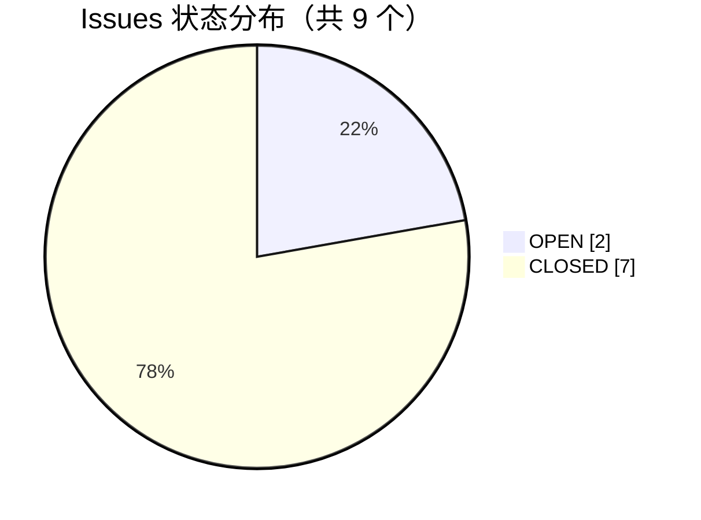
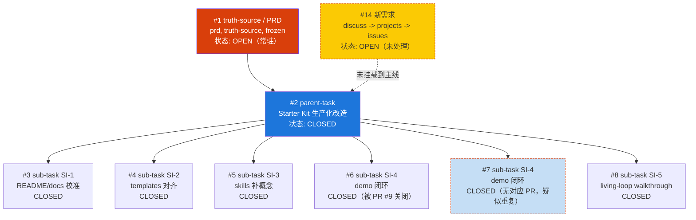
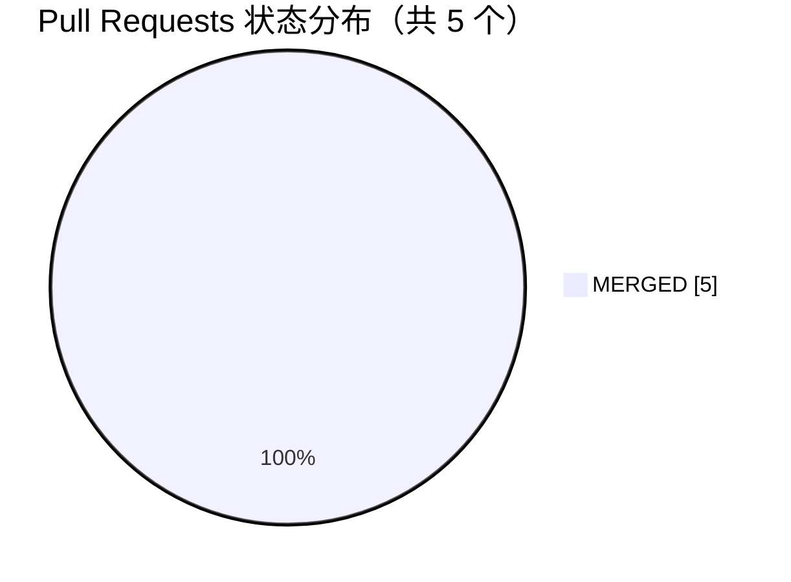
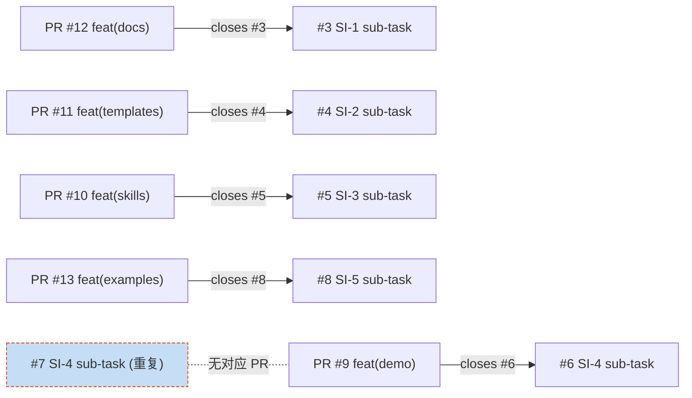
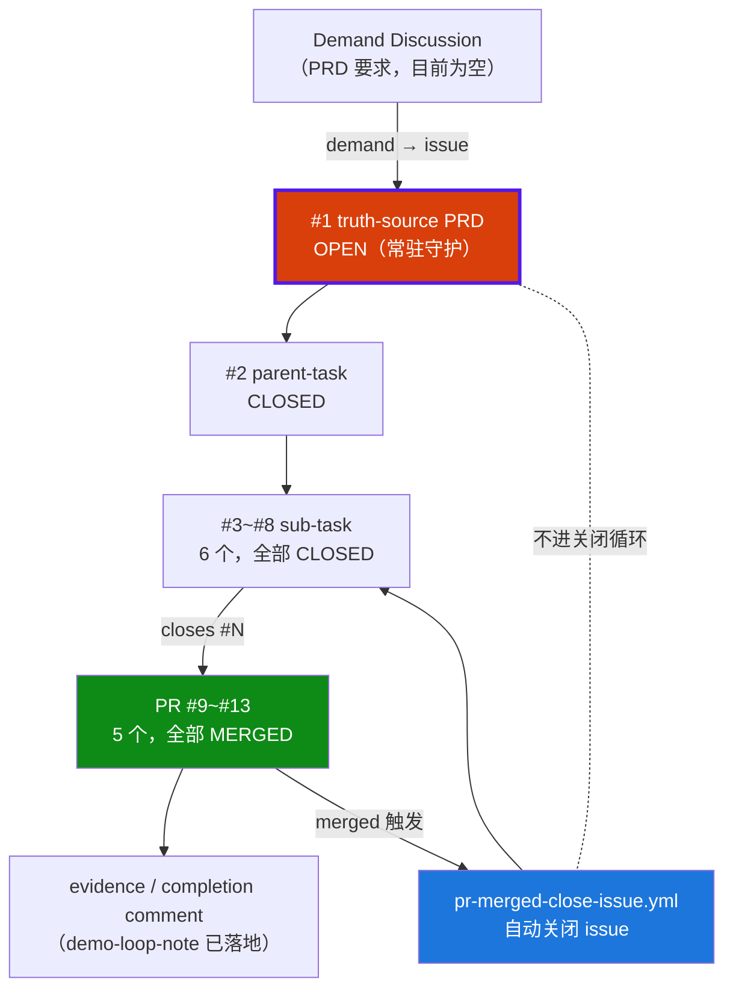

# GitHub Harness 项目线上动态汇总

> 本文档汇总 `github-harness-programming-resources` 仓库的线上动态数据，覆盖 Issues、Pull Requests、Discussions、Labels 与仓库元信息，并基于数据给出活体闭环验证结论与综合观察。
>
> 数据采集时间窗口：仓库创建（2026-06-27）至最近更新（2026-07-08）；本文档生成于 2026-07-12。
>
> 仓库 URL：https://github.com/kun-content-lab/github-harness-programming-resources

---

## 1. 概述

`github-harness-programming-resources` 是一个 **Copy-and-use starter kit**，用于把 GitHub 当作 AI 工作的控制面（control plane），让 Discussion → Issue → PR / evidence comment → review 的活体闭环可以跑通。

本文档从线上视角回答四个问题：

1. 仓库现在的"活体状态"是什么样（Issues / PRs / Discussions / Labels 分布）；
2. 三层 issue 体系（truth-source → parent-task → sub-task）是否真正落地；
3. `pr-merged-close-issue.yml` 自动关闭机制与 truth-source 守护机制是否有效；
4. 还有哪些未处理的新需求与潜在隐患。

---

## 2. 仓库元信息

| 字段 | 值 |
|---|---|
| 仓库 | `kun-content-lab/github-harness-programming-resources` |
| 描述 | Copy-and-use starter kit for running AI work through GitHub Harness workflows |
| 创建时间 | 2026-06-27T06:42:27Z |
| 最近更新 | 2026-07-08T08:54:30Z |
| 默认分支 | `main` |
| 语言统计 | 仅 Mermaid（无传统编程语言源码） |
| 可见性 | Public（公开仓库） |
| Discussions | 已启用 |
| Issues | 已启用 |
| Projects | 未在本次数据中体现 |

> 备注：仓库语言统计只识别 Mermaid，是因为主体为 Markdown 文档 + YAML workflow + Mermaid 图，没有传统编程语言源码。

---

## 3. Issues 动态汇总

### 3.1 总数与状态分布

Issues 总数：**9 个**

| 状态 | 数量 | 占比 | 编号 |
|---|---|---|---|
| OPEN | 2 | 22.2% | #1, #14 |
| CLOSED | 7 | 77.8% | #2, #3, #4, #5, #6, #7, #8 |

### 3.2 完整 Issue 列表

| 编号 | 状态 | 标题 | 标签 |
|---|---|---|---|
| #1 | OPEN | [truth-source] PRD · GitHub Harness Starter Kit 生产化改造（文件 + 活体双轨） | prd, truth-source, frozen |
| #2 | CLOSED | [parent] Starter Kit 生产化改造 · 控制面活体闭环 | parent-task |
| #3 | CLOSED | [sub] SI-1 · README/docs 校准：反映 .github 能力 + 活体指针 + Discussions 开启说明 | sub-task |
| #4 | CLOSED | [sub] SI-2 · 根 templates/ 与 .github 模板对齐（消除两套不一致） | sub-task |
| #5 | CLOSED | [sub] SI-3 · skills/github-harness-workflow 补 parent/sub/truth-source/completion 概念 | sub-task |
| #6 | CLOSED | [sub] SI-4 · [demo] 冻结示例：Demand Discussion + task Issue + feat PR + completion 闭环 | sub-task |
| #7 | CLOSED | [sub] SI-4 · [demo] 冻结示例：Demand Discussion + task Issue + feat PR + completion 闭环 | sub-task |
| #8 | CLOSED | [sub] SI-5 · examples/ 补端到端 living-loop walkthrough | sub-task |
| #14 | OPEN | 工作流闭环中可以增加 discuss -> projects -> issues | （无标签） |

### 3.3 三层 Issue 体系分析

仓库已落地清晰的三层 issue 控制面结构：`truth-source` → `parent-task` → `sub-task`。

层级含义：

- **truth-source（#1）**：长期事实真理源，PRD 主线，挂 `prd / truth-source / frozen` 三个标签，**不进关闭循环**，即使下游全部 CLOSED 仍保持 OPEN，是控制面的"北极星"。
- **parent-task（#2）**：父任务 / Epic 追踪主线，承接 PRD 拆出的可执行单元集合。本例中已 CLOSED，代表本轮生产化改造的执行主线已完成。
- **sub-task（#3 ~ #8）**：PRD 子任务，每个对应一个 SI-* 编号，是真正被领取并交付的执行单元，全部 CLOSED。

### 3.4 关键议题说明

#### #1 truth-source PRD（OPEN，常驻）
- 标签：`prd`、`truth-source`、`frozen`
- 角色：整个仓库的需求真理源，描述"文件 + 活体双轨"生产化改造方向
- 状态含义：即使 #2 及全部 #3~#8 已 CLOSED，PRD 仍保持 OPEN，验证了 truth-source 守护机制——真理源不进关闭循环。

#### #2 parent-task（CLOSED）
- 标签：`parent-task`
- 角色：本轮生产化改造的父任务主线，串联 5 个 SI 子任务（实际创建了 6 个 sub-task issue，因为 SI-4 拆出 #6 / #7 两个重复 issue）

#### #6 / #7 重复 sub-task（SI-4）
- #6 与 #7 标题完全一致，均为 SI-4 demo 闭环 sub-task
- 仅 #6 被 PR #9 通过 `closes #6` 关闭，#7 无对应 PR
- #7 的 CLOSED 状态应为人工手动关闭，是活体闭环中一处可观察到的重复创建痕迹

#### #14 新需求（OPEN，未处理）
- 标题：工作流闭环中可以增加 `discuss -> projects -> issues`
- 标签：无
- 状态：OPEN，未挂载到 #2 主线下，也未分配 sub-task 标签，属于待评估的新流程提议

---

## 4. Pull Requests 动态汇总

### 4.1 总数与状态分布

PR 总数：**5 个**

| 状态 | 数量 | 编号 |
|---|---|---|
| MERGED | 5 | #9, #10, #11, #12, #13 |
| OPEN | 0 | — |
| CLOSED（未合并） | 0 | — |

### 4.2 完整 PR 列表（含关联文件）

| 编号 | 标题 | 关联文件 | 合并状态 |
|---|---|---|---|
| #9 | feat(demo): SI-4 #6 demo 闭环——新增 assets/demo-loop-note + 演示自动 close | `assets/README.md`（MODIFIED）, `assets/demo-loop-note.md`（ADDED） | MERGED |
| #10 | feat(skills): SI-3 #5 补三层 issue + 两种 comment + Refs 纪律 | `skills/github-cognitive-surface-lite/SKILL.md`（MODIFIED）, `skills/github-harness-workflow/SKILL.md`（MODIFIED） | MERGED |
| #11 | feat(templates): SI-2 #4 根 templates 与 .github 对齐 | `templates/discussion-demand-confirmation.md`, `templates/evidence-comment.md`, `templates/pr-description.md`, `templates/review-checklist.md`, `templates/task-issue.md`（均 MODIFIED） | MERGED |
| #12 | feat(docs): SI-1 #3 README/docs 校准 + labels.md + 活体指针 | `README.en.md`, `README.md`（MODIFIED）, `docs/labels.md`（ADDED）, `docs/surface-map.md`（MODIFIED） | MERGED |
| #13 | feat(examples): SI-5 #8 living-loop walkthrough | `examples/living-loop-walkthrough.md`（ADDED） | MERGED |

### 4.3 PR 与 Issue 对应关系

5 个 PR 与 5 个 sub-task issue 形成一一对应（#6 / #7 重复，仅 #6 被关闭），全部通过 PR 描述里的 `closes #N` 触发 `pr-merged-close-issue.yml` 自动关闭 issue。

| PR | 关闭的 Issue | 子任务编号 | 主题 |
|---|---|---|---|
| #12 | #3 | SI-1 | README/docs 校准 |
| #11 | #4 | SI-2 | templates 与 .github 对齐 |
| #10 | #5 | SI-3 | skills 补三层 issue + comment 概念 |
| #9 | #6 | SI-4 | demo 闭环（冻结示例） |
| #13 | #8 | SI-5 | living-loop walkthrough |
| — | #7 | SI-4（重复） | 无对应 PR，疑似手动关闭 |

### 4.4 PR 标签使用情况

- 所有 5 个 PR 的 `labels` 字段均为空，**PR 未挂任何标签**。
- 标签体系主要挂在 issue 侧做控制面分类（truth-source / parent-task / sub-task 等），PR 侧依靠 Conventional Commits 前缀（`feat(scope):`）做语义分类。
- 这与仓库设计一致：**issue 是控制面，PR 是执行面**，标签在控制面侧维护。

---

## 5. Discussions 动态汇总

| 字段 | 值 |
|---|---|
| 是否启用 | 已启用（GraphQL 查询成功） |
| Discussions 总数 | 0 条（`totalCount: 0`，`nodes: []`） |
| Demand Discussion category | PRD 中明确需在 repo settings 手动开启 |

说明：

1. **功能层面已启用**：仓库 Settings 中 Discussions 功能已开启，GraphQL 能正常返回结果。
2. **内容层面为空**：尚无任何 Discussion 节点，与 Issue #1 PRD 中"Demand Discussion category 需在 repo settings 手动开启"的描述一致——category 本身需要手动创建，目前还没有任何 demand 被发起。
3. **设计意图**：按 PRD 设计，Discussions 的 Demand category 应该是活体闭环的入口（demand → discussion → issue → pr → completion），但目前仓库本身是 starter kit 模板仓库，演示用途的 demand 走的是 Issue #6 demo 流，而不是真实 Discussion 流。

---

## 6. Labels 动态汇总

### 6.1 总数与分类

Labels 总数：**17 个**（9 个 GitHub 默认 + 8 个自定义）

| 类别 | 数量 |
|---|---|
| 自定义标签 | 8 |
| GitHub 默认标签 | 9 |

### 6.2 自定义标签完整列表

| 名称 | 颜色 | 描述 |
|---|---|---|
| `prd` | `#5319e7` | PRD 主线 / 产品需求总入口 |
| `truth-source` | `#0e8a16` | 长期事实真理源，不进关闭循环 |
| `parent-task` | `#1d76db` | 父任务 / Epic 追踪主线 |
| `sub-task` | `#c5def5` | PRD 子任务 |
| `task` | `#FBCA04` | 可领取的执行单元 |
| `demo` | `#a2eeef` | 冻结示例，供抄走者参考，非真实开发 |
| `phase-a` | `#fbca04` | 第一性 MVP |
| `frozen` | `#d93f0b` | 冻结常驻，不进领取循环 |

### 6.3 GitHub 默认标签列表

`bug`、`documentation`、`duplicate`、`enhancement`、`good first issue`、`help wanted`、`invalid`、`question`、`wontfix`

### 6.4 标签在 Issue 上的使用情况

| 标签 | 使用 Issue | 数量 |
|---|---|---|
| `prd` | #1 | 1 |
| `truth-source` | #1 | 1 |
| `frozen` | #1 | 1 |
| `parent-task` | #2 | 1 |
| `sub-task` | #3, #4, #5, #6, #7, #8 | 6 |
| `task` | — | 0 |
| `demo` | — | 0 |
| `phase-a` | — | 0 |

观察：

1. `truth-source` + `frozen` + `prd` 三标签集中在 #1，形成真理源的"三重守护"。
2. `sub-task` 标签覆盖了 #3 ~ #8 共 6 个 issue，是本轮执行面主力的标签。
3. `task` / `demo` / `phase-a` 三个自定义标签**目前未在任何 issue 上使用**：
   - `task`（可领取的执行单元）：当前所有可执行单元都以 `sub-task` 形态存在，没有走到 `task` 领取层；
   - `demo`（冻结示例）：#6 / #7 实际是 demo 闭环示例，但并未挂 `demo` 标签，仅通过标题里的 `[demo]` 标识；
   - `phase-a`（第一性 MVP）：未挂载，可能是为后续阶段预留。

---

## 7. 活跃贡献者

### 7.1 Issue 贡献者

| 贡献者 | Issue 数量 | 占比 | 说明 |
|---|---|---|---|
| `kkunkunya` | 8 | 88.9% | 主力贡献者,创建了 #2~#8(parent Epic + 6 个 sub-task) |
| `7Dt3V5TmzAtfur` | 1 | 11.1% | 创建了 #1(truth-source PRD 真理源) |

### 7.2 Pull Request 贡献者

| 贡献者 | PR 数量 | 占比 | 说明 |
|---|---|---|---|
| `kkunkunya` | 5 | 100% | 全部 PR 均由此贡献者提交并合并 |

### 7.3 贡献者观察

- **`kkunkunya`** 是项目的核心贡献者,承担了 88.9% 的 issue 创建与 100% 的 PR 提交,是活体闭环的主要执行者
- **`7Dt3V5TmzAtfur`** 负责冻结产品定义(truth-source PRD),扮演产品需求侧角色
- 两位贡献者的分工体现了 GitHub Harness 的设计理念:需求方冻结真理源,执行方拆解并交付
- 所有 PR 均由单一贡献者提交,说明本项目目前为个人/小团队运作模式

---

## 8. 综合观察与发现

### 观察 1：活体闭环已跑通

5 个 PR 全部 MERGED，对应 5 个 sub-task issue（#3、#4、#5、#6、#8）全部 CLOSED，形成 PR 合并 → issue 自动关闭的完整链路，验证了 `pr-merged-close-issue.yml` workflow 的自动关闭机制有效。这是 starter kit 最核心的能力证明——**活体闭环不是文档上的承诺，而是线上真实跑通过的**。

### 观察 2：三层 issue 体系清晰落地

`truth-source`（#1）→ `parent-task`（#2）→ `sub-task`（#3~#8）的父子控制面结构已在线上落地，标签体系与 issue 标题前缀（`[truth-source]` / `[parent]` / `[sub]`）双重对齐，控制面语义清晰可读。

### 观察 3：PR 未使用标签

所有 5 个 PR 的 labels 字段均为空，标签主要挂在 issue 侧做控制面分类。这与"issue 是控制面、PR 是执行面"的设计一致——PR 依靠 Conventional Commits 前缀（`feat(scope):`）做语义分类，不需要再挂标签。但这也意味着如果未来要在 PR 侧做自动化分流（例如按 `phase-a` / `demo` 路由 review），需要补充 PR 标签策略。

### 观察 4：Discussions 形态吻合 PRD 描述

功能已启用但内容为空，与 Issue #1 PRD 中"Demand Discussion category 需在 repo settings 手动开启"的描述吻合。category 需要手动创建这一细节，是 starter kit 使用者复制仓库后容易遗漏的配置点。

### 观察 5：#7 与 #6 重复创建

#7 与 #6 标题完全相同，均为 SI-4 demo 闭环 sub-task，疑似重复创建。仅 #6 被 PR #9 通过 `closes #6` 关闭，#7 仍 CLOSED 但无对应 PR，应为人工手动关闭。这是活体闭环流程中一处可观察到的"重复创建痕迹"，建议在 `issue-opened-hint.yml` 或 PRD 中补充 sub-task 去重检查步骤。

### 观察 6：#1 truth-source PRD 保持 OPEN

即使所有下游 issue（#2 ~ #8）都已 CLOSED，PRD 真理源 #1 仍保持 OPEN。这验证了 truth-source 守护机制——**真理源不进关闭循环**，作为长期事实真理源常驻，确保后续新需求（如 #14）仍能挂回主线。

### 观察 7：#14 新需求未处理

#14 提出"在工作流闭环中增加 `discuss -> projects -> issues`"的流程扩展，目前 OPEN 未处理，且未挂任何标签、未挂载到 #2 主线下。这是一个待评估的流程改进提议，可能影响下一轮工作流设计（在 Discussion 与 Issue 之间引入 GitHub Projects 作为看板层）。

---

## 9. 活体闭环验证

### 9.1 `pr-merged-close-issue.yml` 自动关闭机制验证

验证对象：仓库 `.github/workflows/pr-merged-close-issue.yml`

验证证据：

| 证据项 | 数据 | 结论 |
|---|---|---|
| PR 合并数 | 5 个 PR 全部 MERGED | ✅ PR 流正常 |
| Issue 自动关闭数 | #3、#4、#5、#6、#8 共 5 个 sub-task 被 `closes #N` 关闭 | ✅ 自动关闭生效 |
| PR 与 issue 一一对应 | 5 PR : 5 issue（#6 / #7 重复，仅 #6 走自动关闭） | ✅ 对应关系清晰 |
| 未合并 PR | 0 个 | ✅ 无异常分支 |
| #7 例外 | 无对应 PR 但 CLOSED | ⚠️ 疑似手动关闭，非自动关闭流程 |

结论：**`pr-merged-close-issue.yml` 自动关闭机制在线上验证有效**，5/5 的合并 PR 都成功触发了对应 issue 的关闭。

### 9.2 truth-source 守护机制验证

验证对象：truth-source 标签 issue 不进关闭循环的设计承诺。

验证证据：

| 证据项 | 数据 | 结论 |
|---|---|---|
| truth-source issue | #1（同时挂 `prd` / `truth-source` / `frozen`） | ✅ 唯一真理源 |
| #1 状态 | OPEN（即使全部下游 CLOSED） | ✅ 守护生效 |
| 下游 issue 关闭情况 | #2 parent-task CLOSED；#3~#8 sub-task 全部 CLOSED | ✅ 下游已全部完成 |
| 是否存在 PR 关闭 #1 | 无任何 PR 描述包含 `closes #1` | ✅ 未被误关闭 |

结论：**truth-source 守护机制在线上验证有效**，PRD 真理源 #1 在所有下游 issue 关闭后仍保持 OPEN，符合"长期事实真理源，不进关闭循环"的设计。

### 9.3 闭环完整性总览

### 9.4 验证总结

| 机制 | 验证结论 | 证据强度 |
|---|---|---|
| `pr-merged-close-issue.yml` 自动关闭 | ✅ 有效 | 强（5/5 PR 全部触发对应 issue 关闭） |
| truth-source 守护（不进关闭循环） | ✅ 有效 | 强（#1 在下游全 CLOSED 后仍 OPEN） |
| 三层 issue 控制面 | ✅ 落地 | 强（标签 + 标题前缀双重对齐） |
| Discussion → Issue 入口 | ⚠️ 待补 | 弱（功能已启用但 category 为空） |
| sub-task 去重 | ⚠️ 待补 | 弱（#6 / #7 重复创建） |

---

## 10. 附：数据来源与采集说明

| 数据类别 | 来源文件 | 备注 |
|---|---|---|
| Issues | `docs/online-activity/issues.json` | 9 条 |
| Pull Requests | `docs/online-activity/pull-requests.json` | 5 条 |
| Discussions | `docs/online-activity/discussions.json` | 0 条 |
| Labels | `docs/online-activity/labels.json` | 17 条 |
| 仓库元信息 | `docs/online-activity/repo-meta.json` | — |

> 本文档基于 2026-07-08 之前的线上数据生成；如需更新，可重新采集 `docs/online-activity/` 下的 JSON 后重新汇总。
