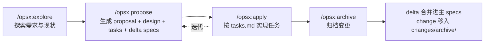
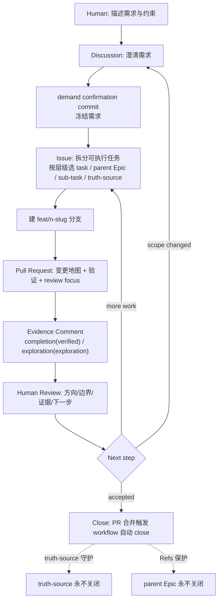

# OpenSpec 与 GitHub Harness 对比说明

## 1. 概述

本文档系统对比两个面向 AI 编码助手的"规范驱动 / 控制面"系统：OpenSpec 与 GitHub Harness。对比目的是帮助读者根据自身项目形态、技术栈与团队习惯做出选型；对比范围涵盖功能特性、技术实现、接口设计、性能与成本、使用场景与优劣势。

两个系统的简短定位如下：

- **OpenSpec**：由 Fission-AI 开源的 spec-driven development（SDD）框架，面向 AI 编码助手。它以 npm CLI + slash command 形态存在，在项目根目录创建 `openspec/` 目录承载 specs 与 changes，通过 `/opsx:explore`、`/opsx:propose`、`/opsx:apply`、`/opsx:archive` 四个 slash command 推动从探索到归档的工作流，并原生集成 20+ AI 工具（Claude Code、Cursor、Codex、GitHub Copilot、Windsurf、Gemini CLI、Cline 等）。核心理念是 fluid not rigid / iterative not waterfall / easy not complex / built for brownfield not just greenfield。
- **GitHub Harness**（`github-harness-programming-resources`）：一个"可以直接拿走用的 starter kit"。它不是框架，也不是运行时，而是一套可复制的 Agent 工作控制面——把 GitHub 当作 AI 工作的控制面（control plane），让每个需求、任务、证据、决策都有它该去的地方。形态是纯 Markdown + YAML（GitHub Actions）+ Mermaid，无 npm 包、无 CLI、无运行时依赖。

二者目标相近（都是让长 AI 工作不散落在聊天里），但路径截然不同：OpenSpec 走"代码 + CLI + spec delta"路线，GitHub Harness 走"GitHub 原生 surface + 模板 + workflow 自动化"路线。

---

## 2. 目录

- [1. 概述](#1-概述)
- [2. 目录](#2-目录)
- [3. 功能特性对比](#3-功能特性对比)
- [4. 技术实现对比](#4-技术实现对比)
  - [4.1 形态对比](#41-形态对比)
  - [4.2 目录结构对比](#42-目录结构对比)
  - [4.3 技术栈对比](#43-技术栈对比)
  - [4.4 数据流与工作流对比](#44-数据流与工作流对比)
- [5. 接口设计对比](#5-接口设计对比)
  - [5.1 OpenSpec 的 slash command 接口](#51-openspec-的-slash-command-接口)
  - [5.2 GitHub Harness 的 GitHub 原生 surface 接口](#52-github-harness-的-github-原生-surface-接口)
  - [5.3 agent 上下文注入方式差异](#53-agent-上下文注入方式差异)
- [6. 性能与成本指标对比](#6-性能与成本指标对比)
- [7. 使用场景与优劣势评估](#7-使用场景与优劣势评估)
  - [7.1 OpenSpec](#71-openspec)
  - [7.2 GitHub Harness](#72-github-harness)
- [8. 总结](#8-总结)
- [9. 参考资料](#9-参考资料)

---

## 3. 功能特性对比

下表从十个关键功能点对比两系统的支持情况。标注含义：支持 / 部分支持 / 不支持 / 不同方式。

| 功能点 | OpenSpec | GitHub Harness | 说明 |
|---|---|---|---|
| 规范/需求存储位置 | 支持 | 不同方式 | OpenSpec 存在仓库根目录 `openspec/specs/` 下按 capability 组织的 `spec.md`；GitHub Harness 把需求冻结在 truth-source issue 与 demand confirmation commit 里，规范即 GitHub 表面内容 |
| 变更追踪机制 | 支持 | 支持 | OpenSpec 用 `changes/<change-id>/` 工作区记录 proposal/design/tasks/specs delta；GitHub Harness 用 Issue + PR + evidence comment 链条，每次变更都有 issue 编号与 PR 编号 |
| 自动化守护 | 部分支持 | 支持 | OpenSpec 的自动化主要在 CLI 与 slash command 流程内；GitHub Harness 有三个 GitHub Actions workflow 做"提示 → 守护 → 关闭"完整链条（issue-opened-hint / pr-merged-close-issue / pr-issue-link-guard） |
| AI 工具集成方式 | 支持 | 不同方式 | OpenSpec 原生集成 20+ AI 工具（Claude Code、Cursor、Codex、Copilot、Windsurf、Gemini CLI、Cline 等）通过 AGENTS.md 注入；GitHub Harness 通过 prompts/AGENTS.example.md + skills/*/SKILL.md 注入，agent 操作 GitHub 原生 surface，不限定具体 AI 工具 |
| 规范组织方式 | 支持 | 不同方式 | OpenSpec 按 capability 纵向组织（如 `specs/auth-session/spec.md`），delta 用 ADDED/MODIFIED/REMOVED 标记；GitHub Harness 按层级组织（truth-source → parent Epic → sub-task → task），用标签区分层级 |
| 变更审查单元 | 支持 | 支持 | OpenSpec 的审查单元是 change 文件夹（proposal + design + tasks + delta spec），review intent not just code；GitHub Harness 的审查单元是 PR（变更地图 + 验证矩阵 + review focus）+ evidence comment（verified/exploration 两种信号） |
| 归档/关闭机制 | 支持 | 支持 | OpenSpec 用 `/opsx:archive` 把 delta spec 合并进主 specs 并归档到 `changes/archive/`；GitHub Harness 用 PR 合并触发 workflow 自动 close 引用的 issue，truth-source 与 parent Epic 用 Refs 保护不关闭 |
| 多模型支持 | 支持 | 支持 | OpenSpec 不绑定模型，通过 profile 配置切换工作流；GitHub Harness 刻意不引入 `delegate:*` / `review:*` 标签，保持模型无关（model-agnostic），把多模型分工留给上层配置 |
| 中文支持 | 部分支持 | 支持 | OpenSpec 的 spec 格式与 CLI 主要面向英文；GitHub Harness 的 workflow 正则同时匹配中英文关闭词（Closes/Fixes/Resolves + 关闭/修复/解决），原生兼容中文 PR body |
| 持久化锚点 | 支持 | 支持 | OpenSpec 的锚点是 `openspec/` 目录下检入 git 的 spec 与 change 文件；GitHub Harness 的锚点是 GitHub 表面（Discussion / Issue / PR / Comment），即使 agent 对话清空也能从 surface 重建状态 |

---

## 4. 技术实现对比

### 4.1 形态对比

| 维度 | OpenSpec | GitHub Harness |
|---|---|---|
| 形态定位 | spec-driven development 框架 | 可复制的 Agent 工作控制面 starter kit |
| 运行时 | 有（npm CLI 进程 + slash command） | 无（纯文档 + 配置，靠 GitHub Actions runner） |
| 安装方式 | `npm install -g @fission-ai/openspec@latest` | 复制 Markdown 文件到目标仓库 |
| 是否需要 Node.js | 是，需 20.19.0+ | 否 |
| 是否需要 API key | 否 | 否 |
| 是否需要 MCP | 否 | 否 |
| 检入 git 的内容 | `openspec/` 目录（specs + changes + config.yaml） | `.github/` + `skills/` + `templates/` + `prompts/` + `workflows/` + `docs/` |
| 项目隔离性 | 每个项目独立 `openspec/` 目录 | 每个项目独立复制一套文件 |

OpenSpec 是"运行时型"——有 CLI 进程、有 slash command 触发、有 schemas 校验；GitHub Harness 是"文档型"——没有运行时进程，所有纪律靠模板（写时约束）+ workflow（合并时约束）+ Skill（agent 行为约束）三层落地。

### 4.2 目录结构对比

OpenSpec 在项目根目录创建的 `openspec/` 目录结构：

```text
project-root/
└── openspec/
    ├── config.yaml                 # 工作流 profile 配置
    ├── specs/                      # 规范库（按 capability 组织）
    │   └── auth-session/
    │       └── spec.md             # 该 capability 的需求与场景
    └── changes/                    # 变更工作区
        ├── <change-id>/            # 一个变更一个文件夹
        │   ├── proposal.md         # 为什么做
        │   ├── design.md           # 技术方案
        │   ├── tasks.md            # 实现清单
        │   └── specs/              # delta spec（ADDED/MODIFIED/REMOVED）
        └── archive/                # 已归档变更
            └── <change-id>/        # 归档时 delta 合并进主 specs 后留存
```

GitHub Harness 复制到目标仓库的目录结构：

```text
project-root/
├── .github/                        # 活模板 + 自动化 workflow
│   ├── COMMENT_TEMPLATE/
│   │   ├── completion-comment.md   # 完成回写模板(verified)
│   │   └── exploration-comment.md  # 探索回写模板(exploration)
│   ├── DISCUSSION_TEMPLATE/
│   │   └── demand-confirmation.md  # 需求确认 Discussion 模板
│   ├── ISSUE_TEMPLATE/
│   │   ├── task.md                 # 任务模板(task 标签)
│   │   ├── parent-task.md          # 父 Epic 模板(parent-task 标签)
│   │   ├── sub-task.md             # 子任务模板(sub-task 标签)
│   │   └── truth-source.md         # 真理源模板(truth-source + frozen 标签)
│   ├── workflows/
│   │   ├── issue-opened-hint.yml   # issue 打开贴提示 + truth-source 守护
│   │   ├── pr-issue-link-guard.yml # PR 缺 Closes/Refs 软提醒
│   │   └── pr-merged-close-issue.yml # PR 合并自动 close + truth-source 守护
│   └── PULL_REQUEST_TEMPLATE.md
├── prompts/                        # 项目级 Agent 指令
│   └── AGENTS.example.md
├── skills/                         # 可复制的 Skill 文件
│   ├── github-harness-workflow/SKILL.md
│   └── github-cognitive-surface-lite/SKILL.md
├── templates/                      # 可复制的模板
├── workflows/                      # 人读版流程文档
├── checklists/                     # 采用与边界检查清单
├── diagrams/                       # Mermaid 图源文件
├── docs/                           # 项目文档
└── examples/                       # 活体示例
```

核心差异：OpenSpec 把所有规范集中在 `openspec/` 一个目录里按 capability 纵向组织；GitHub Harness 把纪律散布到 `.github/`（GitHub 原生模板与 workflow）+ `skills/`（agent 行为）+ `templates/`（可复制骨架）+ `workflows/`（人读流程）多个目录，让每个 GitHub 表面都有对应模板。

### 4.3 技术栈对比

| 技术栈 | OpenSpec | GitHub Harness |
|---|---|---|
| 实现语言 | TypeScript / Node.js | 无传统源码（Markdown + YAML + Mermaid） |
| 包管理 | npm（`@fission-ai/openspec`） | 无 |
| 运行时依赖 | Node.js 20.19.0+ | 无（GitHub Actions runner 自带 bash + Python3） |
| 校验机制 | JSON schema（`schemas/spec-driven/`） | GitHub 模板 front matter + workflow 正则 |
| 自动化技术 | TypeScript CLI + slash command | GitHub Actions（bash + gh CLI + 内嵌 Python3 正则） |
| 测试框架 | vitest（`vitest.config.ts`） | 无（活体闭环 issue #1~#8 / PR #9~#13 作为验证） |
| 构建工具 | `build.js` | 无需构建 |
| 图表 | 无强制要求 | Mermaid（`diagrams/*.mmd` + 文档内嵌） |
| 依赖文件 | `package.json` | 无（无 `package.json` / `requirements.txt` / `Cargo.toml` / `go.mod`） |

### 4.4 数据流与工作流对比

OpenSpec 的工作流是 explore → propose → apply → archive 四阶段：



GitHub Harness 的工作流是 Discussion → Issue → PR → Evidence → Review → Close 七步闭环：



核心差异：

- **OpenSpec 的回流是迭代型**——apply 阶段可以反复回到 propose 调整设计，工作流是"fluid not rigid"，没有硬性 phase gate。
- **GitHub Harness 的回流是结构性**——scope changed 必须回 Discussion 重新对齐，不能在执行型 issue 里偷偷改方向；more work 回 Issue 继续；只有 accepted 才 Close。三条回流路径用 `skills/github-harness-workflow/SKILL.md` 明确约束。

---

## 5. 接口设计对比

### 5.1 OpenSpec 的 slash command 接口

OpenSpec 通过 slash command 暴露四个核心动作，每个动作对应一个工作流阶段：

| Slash Command | 阶段 | 输入 | 输出 |
|---|---|---|---|
| `/opsx:explore` | 探索 | 自然语言问题、现有 specs | 探索笔记、候选 change 方向 |
| `/opsx:propose` | 提案 | 探索结果 | `changes/<change-id>/` 下的 proposal.md / design.md / tasks.md / specs/ delta |
| `/opsx:apply` | 实现 | tasks.md 中的任务项 | 代码变更 + tasks.md 勾选 |
| `/opsx:archive` | 归档 | 已完成的 change | delta 合并进主 specs，change 移入 `changes/archive/` |

旧版命令 `/openspec:proposal` 仍兼容。CLI 命令包括 `openspec init`（初始化）、`openspec update`（刷新 agent 指令）、`openspec config profile`（切换工作流 profile）。

delta spec 的格式约定：

```markdown
## ADDED Requirement: <name>

#### Scenario: <scenario name>
- GIVEN <前置条件>
- WHEN <动作>
- THEN <预期结果>

## MODIFIED Requirement: <name>
...

## REMOVED Requirement: <name>
...
```

### 5.2 GitHub Harness 的 GitHub 原生 surface 接口

GitHub Harness 不发明新接口，直接用 GitHub 原生 surface 作为 agent 的操作面：

| GitHub Surface | 接口角色 | agent 动作 | 自动化守护 |
|---|---|---|---|
| Discussion | 需求确认 | 提问、写 demand confirmation commit | 无（人工纪律） |
| Issue | 任务定义 | 选层级（task / parent Epic / sub-task / truth-source）、重述 goal/scope/acceptance | `issue-opened-hint.yml` 贴提示 / truth-source 贴冻结提示 |
| Pull Request | 文件变更审查 | body 写 `Closes #<task/sub>` 或 `Refs #<parent/truth-source>` | `pr-issue-link-guard.yml` 检查缺链接软提醒；`pr-merged-close-issue.yml` 合并时关闭引用 issue |
| Comment | 证据/决策/下一步 | 写 completion-comment（verified）或 exploration-comment（exploration） | 无（人工审查） |
| Project board | 多任务协调 | 排序、状态、阻塞项 | 无（仅在多 issue 时加入） |

链接纪律是 GitHub Harness 接口设计的核心约束：

```text
Closes #<task/sub>   →  合并到 main 时自动关闭 issue（执行型）
Refs #<parent/truth-source>  →  只关联，永不关闭（控制面）
```

`pr-merged-close-issue.yml` 的正则只匹配 `Closes/Fixes/Resolves`（含中文"关闭/修复/解决"），刻意不匹配 `Refs`，从源头防止控制面被误关。

### 5.3 agent 上下文注入方式差异

两者都用 AGENTS.md 作为 agent 上下文入口，但注入内容与触发方式不同：

| 维度 | OpenSpec | GitHub Harness |
|---|---|---|
| 入口文件 | `AGENTS.md`（由 `openspec init` / `openspec update` 生成） | `prompts/AGENTS.example.md`（复制后改名为 `AGENTS.md`） |
| 注入内容 | spec-driven 工作流指令、slash command 用法、delta spec 格式、capability 组织规则 | GitHub Harness 工作流指令、Skill 引用、模板与 workflow 纪律 |
| 触发方式 | slash command（`/opsx:explore` 等）显式触发 | 自然语言触发 + GitHub 表面事件触发（issue opened / PR opened / PR merged） |
| 行为规范载体 | slash command 内置 prompt + schema 校验 | `skills/github-harness-workflow/SKILL.md`（流程规范）+ `skills/github-cognitive-surface-lite/SKILL.md`（写作规范） |
| 模板载体 | `changes/<change-id>/*.md` 由 slash command 生成 | `.github/ISSUE_TEMPLATE/*.md`、`.github/PULL_REQUEST_TEMPLATE.md`、`.github/COMMENT_TEMPLATE/*.md` 由 GitHub 原生加载 |

核心差异：OpenSpec 是"agent 主动调用 slash command 推进流程"，GitHub Harness 是"agent 操作 GitHub 原生 surface，workflow 在事件触发时自动守护"。前者是命令式触发，后者是事件驱动 + 模板约束。

---

## 6. 性能与成本指标对比

| 指标 | OpenSpec | GitHub Harness |
|---|---|---|
| 安装成本 | 需 `npm install -g @fission-ai/openspec@latest`，要求 Node.js 20.19.0+ | 仅复制 Markdown 文件，无安装 |
| 运行时开销 | 有 CLI 进程开销（每次 slash command 启动 Node 进程） | 无运行时进程；自动化靠 GitHub Actions runner（bash + Python3） |
| token 效率 | slash command 内置 prompt 较长，但 spec delta 结构化，审查时 token 集中在变更部分 | Skill 文件按需加载，agent 只在需要时读 SKILL.md；GitHub 表面内容人话在前、机器在后，审查 token 效率高 |
| 项目隔离性 | 每个项目独立 `openspec/` 目录，互不干扰 | 每个项目独立复制一套文件，互不干扰 |
| 外部依赖 | Node.js 运行时 + npm 包 | 无外部依赖（GitHub Actions runner 自带环境） |
| API key 需求 | 无 | 无 |
| MCP 需求 | 无 | 无 |
| 学习成本 | 需学 slash command、delta spec 格式、capability 组织 | 需学三层 issue 体系、链接纪律、五个 surface 职责 |
| 跨项目复用 | 通过 `openspec init` 在新项目初始化 | 通过复制文件到新仓库 |
| 自动化执行环境 | 本地 Node.js | GitHub Actions runner（云端） |

要点：

- **OpenSpec** 需 npm 全局安装 + Node.js 20.19.0+，有 CLI 进程开销，但无 API key / MCP；自动化在本地或 CI 中通过 slash command 触发。
- **GitHub Harness** 仅复制 Markdown 文件，无运行时依赖；自动化靠 GitHub Actions runner（云端），无外部依赖，所有脚本用 runner 自带的 bash + Python3。

---

## 7. 使用场景与优劣势评估

### 7.1 OpenSpec

| 维度 | 评估 |
|---|---|
| 适用场景 | 代码型项目；需要 spec delta 让审查者快速理解变更意图；brownfield 遗留项目（built for brownfield）；使用 Claude Code / Cursor / Codex 等已原生集成的 AI 工具；团队需要并行变更（多个 change 文件夹不冲突） |
| 主要优势 | 1. spec delta 让 review intent not just code，审查者看 ADDED/MODIFIED/REMOVED 即懂变更范围；2. 原生集成 20+ AI 工具，开箱即用；3. brownfield-first，为遗留项目而生；4. 并行变更友好，多个 change 文件夹互不冲突；5. specs 检入 git 作为活文档，团队可读可审；6. fluid not rigid，无硬性 phase gate |
| 主要局限 | 1. 需要 Node.js 20.19.0+ 与 npm 全局安装，对非 JS 项目是额外依赖；2. spec 格式与 CLI 主要面向英文，中文团队需要额外适配；3. 自动化主要在 slash command 流程内，缺少 GitHub 表面级的自动守护；4. Workspaces（面向团队多 repo 规划）仍在开发中；5. 不绑定 GitHub，无法利用 GitHub 原生 issue/PR/Discussion 作为持久锚点 |

### 7.2 GitHub Harness

| 维度 | 评估 |
|---|---|
| 适用场景 | GitHub 原生流程团队；需要控制面守护（防止 parent Epic / truth-source 被误关）；中文团队（workflow 原生兼容中文 PR body）；想让 AI agent 直接操作 GitHub surface 的团队；希望无运行时依赖、复制即用的 starter kit |
| 主要优势 | 1. 无运行时依赖，复制 Markdown 即用；2. 三层 issue 体系解决粒度失控、控制面被误关、真理源被污染三个问题；3. 链接纪律（Closes vs Refs）+ truth-source 双重守护是硬工程约束；4. 三个 workflow 形成"提示 → 守护 → 关闭"完整链条且全部软约束不阻断；5. 中文 PR body 兼容（Python 正则同时匹配中英文关闭词）；6. 模型无关，不绑定具体 AI 模型；7. 活体闭环验证（本仓自己用这套跑过 issue #1~#8、PR #9~#13） |
| 主要局限 | 1. 强依赖 GitHub 生态（Issues / Discussions / PR / Actions），不适合 GitLab / Bitbucket 等平台；2. 无 spec delta 格式，审查单元是 PR + evidence comment，对纯规范审查不如 OpenSpec 结构化；3. 没有 CLI，所有操作通过 GitHub UI 或 gh CLI 手动完成；4. 需要手动复制文件并建标签，初始采用成本高于 `openspec init`；5. spec 不是按 capability 纵向组织，跨 issue 的规范聚合需要人工维护 |

---

## 8. 总结

一句话选型建议：

- **代码型项目 / 需要 spec delta 审查 / 使用已原生集成的 AI 工具** → 选 OpenSpec；
- **GitHub 原生流程 / 需要控制面守护 / 中文团队 / 希望无运行时依赖** → 选 GitHub Harness；
- **两者可互补**——OpenSpec 负责 spec 与变更的结构化，GitHub Harness 负责 GitHub 表面的控制面与自动化守护，二者可在同一项目共存（OpenSpec 的 `openspec/` 目录与 GitHub Harness 的 `.github/` + `skills/` 互不冲突）。

---

## 9. 参考资料

### OpenSpec

- 官方仓库：[https://github.com/Fission-AI/OpenSpec](https://github.com/Fission-AI/OpenSpec)
- 官网：[https://openspec.dev/](https://openspec.dev/)

### GitHub Harness（本仓库文档）

- [核心执行逻辑分析](./core-logic.md) —— GitHub Harness 核心执行逻辑（三层 issue、链接纪律、三个 workflow、两个 Skill）
- [项目概览](./project-overview.md) —— GitHub Harness 项目概览（目录结构、技术栈、关键特性、快速开始）
- [标签系统](./label-system.md) —— GitHub Harness 标签系统（8 个自定义标签、模型无关设计）
- 仓库主页：[https://github.com/kun-content-lab/github-harness-programming-resources](https://github.com/kun-content-lab/github-harness-programming-resources)
