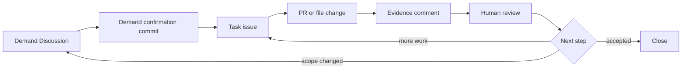

# GitHub Harness 项目概览

> 本文档是 `github-harness-programming-resources` 仓库的总览入口：一句话说清它是什么，再依次给出仓库元信息、用途、目标用户、完整目录结构、技术栈、关键特性、工作流程、快速开始与相关文档链接。
>
> 文档中引用仓库内文件时，路径均相对于仓库根目录 `github-harness-programming-resources/`。

---

## 1. 项目概述

`github-harness-programming-resources` 是一个**可以直接拿走用的 GitHub Harness starter kit**——它不是框架，也不是运行时，而是一套可复制到你自己仓库里的 **Agent 工作控制面**：项目提示词、Skill、GitHub templates、workflow、checklist 与 demo。复制进去以后，就可以让 AI agent 按 Discussion → Issue → PR / evidence comment → review 的方式持续推进项目。

一句话概括：

> **把 GitHub 当作 AI 工作的控制面（control plane），让每个需求、任务、证据、决策都有它该去的地方，而不是散落在聊天里。**

---

## 2. 仓库元信息

| 字段 | 值 |
|---|---|
| 仓库名 | `github-harness-programming-resources` |
| 描述 | Copy-and-use starter kit for running AI work through GitHub Harness workflows |
| 默认分支 | `main` |
| 语言统计 | 仅 Mermaid（size = 283 字节） |
| 是否私有 | `false`（公开仓库） |
| 创建时间 | 2026-06-27T06:42:27Z |
| 最近更新 | 2026-07-08T08:54:30Z |
| 仓库 URL | https://github.com/kun-content-lab/github-harness-programming-resources |
| License | MIT |

> 备注：仓库语言统计只识别 Mermaid，是因为它没有传统编程语言源码——主体是 Markdown 文档 + YAML workflow + Mermaid 图。详见第 6 节技术栈。

---

## 3. 项目用途

### 3.1 它解决什么问题

长 AI 工作失败，往往是因为**所有状态都留在聊天里**。一旦对话变长，agent 就会丢失三件事之间的关系：

1. 当前任务与之前决策的关系；
2. 当前任务与已有证据的关系；
3. 当前任务与人类审查期待的关系。

聊天是易失的、线性的、无结构的。它没有"这个地方放需求""那个地方放证据"的稳定锚点。

### 3.2 它的解法

GitHub Harness 的核心理念是：**把工作钉在持久的 GitHub 表面上**。每个 GitHub 表面（Discussion / Issue / PR / Comment / Board）都有**一个职责**：

| 需求 | GitHub 表面 |
|---|---|
| 澄清需求 | Discussion |
| 执行一个任务 | Issue |
| 审查文件变更 | Pull Request |
| 记录证据 | Comment |
| 跟踪多任务 | Project board |

这套 kit 提供的，就是让 agent 永远知道四件事的完整基建：

1. **需求从哪来**（源头可追溯）；
2. **当前任务边界是什么**（不会越界）；
3. **必须产出什么证据**（不能空口说完成）；
4. **人类会审查什么**（方向、边界、证据、下一步）。

### 3.3 它提供什么

| 内容 | 形态 |
|---|---|
| 项目级 Agent 指令 | `prompts/AGENTS.example.md` |
| 工作流程规范 Skill | `skills/github-harness-workflow/SKILL.md` |
| 写作规范 Skill | `skills/github-cognitive-surface-lite/SKILL.md` |
| GitHub 活模板 | `.github/` 下的 Issue / PR / Comment / Discussion 模板 |
| 自动化 workflow | `.github/workflows/` 三个 GitHub Actions |
| 可照着跑的流程 | `workflows/` 三个 Markdown 流程文档 |
| 可复制模板 | `templates/` 五个独立模板 |
| 采用与边界检查 | `checklists/` 两份清单 |
| 活体示例 | `examples/` living-loop walkthrough + demo |
| 项目文档 | `docs/` 六篇说明 |

复制到自己的仓库后，AI agent 即可按统一纪律推进项目。

---

## 4. 适合谁

| 你现在的情况 | 这个仓库提供什么 |
|---|---|
| AI 对话太散，任务一长就找不到上下文 | 把需求、任务、证据和验收放进 GitHub |
| 想让 AI 不只是聊天，而是持续推进项目 | `github-harness-workflow` Skill |
| 想直接复用一套 GitHub issue / PR / comment 模板 | `.github/` 和 `templates/` |
| 想给自己的项目加一份 Agent 项目说明 | `prompts/AGENTS.example.md` |
| 想先跑一个最小闭环 | demand Discussion → task issue → evidence comment |

---

## 5. 完整目录结构

```
github-harness-programming-resources/
├── .github/                          # 活模板 + 自动化 workflow + 标签
│   ├── COMMENT_TEMPLATE/
│   │   ├── completion-comment.md     # 完成回写模板(verified)
│   │   └── exploration-comment.md    # 探索回写模板(exploration)
│   ├── DISCUSSION_TEMPLATE/
│   │   └── demand-confirmation.md    # 需求确认 Discussion 模板
│   ├── ISSUE_TEMPLATE/
│   │   ├── kit-feedback.md           # kit 反馈模板
│   │   ├── parent-task.md            # 父 Epic 模板(parent-task 标签)
│   │   ├── sub-task.md               # 子任务模板(sub-task 标签)
│   │   ├── task.md                   # 任务模板(task 标签)
│   │   └── truth-source.md           # 真理源模板(truth-source + frozen 标签)
│   ├── workflows/
│   │   ├── issue-opened-hint.yml     # issue 打开贴提示 + truth-source 守护
│   │   ├── pr-issue-link-guard.yml   # PR 缺 Closes/Refs 软提醒
│   │   └── pr-merged-close-issue.yml # PR 合并自动 close + truth-source 守护
│   └── PULL_REQUEST_TEMPLATE.md      # PR 模板
├── assets/                           # README 视觉资产
│   ├── brand/                        # banner.svg, logo.svg, social-preview.svg
│   ├── workflow/                     # github-harness-loop.svg
│   ├── README.md
│   └── demo-loop-note.md
├── checklists/                       # 采用检查清单
│   ├── adoption-checklist.md         # 采用检查
│   └── public-boundary-checklist.md  # 公开边界检查
├── diagrams/
│   └── minimum-harness-engine.mmd    # 最小 harness 引擎图
├── docs/                             # 项目文档
│   ├── adoption-guide.md             # 如何复制到你的 repo
│   ├── how-it-works.md               # GitHub Harness 工作方式
│   ├── labels.md                     # 标签说明
│   ├── public-boundary.md            # 公开边界
│   ├── surface-map.md                # 表面映射
│   └── verification.md               # 公开前验证记录
├── examples/                         # 示例
│   ├── ai-resource-index-harness-demo.md
│   └── living-loop-walkthrough.md    # 活体循环演练
├── prompts/                          # 项目级 Agent 指令
│   ├── AGENTS.example.md             # AGENTS.md 示例
│   └── project-harness-instructions.md
├── skills/                           # 可复制的 Skill 文件
│   ├── github-cognitive-surface-lite/
│   │   └── SKILL.md                  # 写 GitHub 表面的规范
│   └── github-harness-workflow/
│       └── SKILL.md                  # GitHub Harness 工作流程
├── templates/                        # 可复制的模板
│   ├── discussion-demand-confirmation.md
│   ├── evidence-comment.md
│   ├── pr-description.md
│   ├── review-checklist.md
│   └── task-issue.md
├── workflows/                        # 可照着跑的流程
│   ├── demand-discussion-to-issue.md
│   ├── issue-to-pr-to-evidence.md
│   └── review-and-close-loop.md
├── .gitignore
├── LICENSE                           # MIT
├── README.md                         # 中文 README
└── README.en.md                      # 英文 README
```

### 目录职责说明

| 目录 / 文件 | 职责 |
|---|---|
| `.github/` | 活模板（issue / PR / comment / discussion）+ 三个自动化 workflow；复制即生效 |
| `assets/` | README 用的 banner / logo / workflow 图等视觉资产 |
| `checklists/` | 采用 kit 时的检查清单与公开边界检查清单 |
| `diagrams/` | 最小 harness 引擎的 Mermaid 图源文件 |
| `docs/` | 项目文档：工作方式、采用指南、表面映射、标签、边界、验证 |
| `examples/` | 活体循环演练与 demo 示例 |
| `prompts/` | 项目级 Agent 指令（AGENTS.md 示例与 harness 指令） |
| `skills/` | 可复制的 Skill：工作流程规范 + 写作规范 |
| `templates/` | 可复制的独立模板（discussion / issue / pr / evidence / review） |
| `workflows/` | 人读版流程文档：需求→issue、issue→PR→证据、review→close |
| `LICENSE` | MIT 许可证 |
| `README.md` / `README.en.md` | 中英文 README |

---

## 6. 技术栈

GitHub Harness 是一个**文档型 + 配置型**项目，没有传统编程语言源码，因此 GitHub 语言统计只识别出 Mermaid。

### 6.1 语言与文件类型

| 类型 | 用途 | 占比 |
|---|---|---|
| Markdown | 文档、模板、Skill、流程说明、checklist | 主体 |
| YAML | `.github/workflows/*.yml` GitHub Actions 配置 | 少量 |
| Mermaid | `diagrams/*.mmd` 与文档内嵌图 | 283 字节（语言统计） |
| SVG | `assets/` 下的 banner / logo / workflow 图 | 资产 |

### 6.2 GitHub Actions（3 个自动化 workflow）

| Workflow | 触发 | 内嵌脚本 | 职责 |
|---|---|---|---|
| `issue-opened-hint.yml` | `issues: [opened]` | bash | 贴领取提示 / truth-source 贴冻结提示 |
| `pr-merged-close-issue.yml` | `pull_request: [closed]` + `merged == true` | bash + 内嵌 Python3 正则 | 解析 Closes 关闭 issue；truth-source 守护；保留分支 |
| `pr-issue-link-guard.yml` | `pull_request: [opened, edited]` | bash + grep | PR 缺 Closes/Refs 软提醒（不阻断） |

### 6.3 GitHub 原生功能

- **Issues**：三层体系（task / parent Epic / sub-task / truth-source）
- **Discussions**：需求确认
- **Pull Requests**：文件变更审查
- **Labels**：8 个自定义 + 9 个默认
- **Issue Templates**：YAML front matter 预配置标签

### 6.4 依赖文件

- **无** `package.json` / `requirements.txt` / `Cargo.toml` / `go.mod` 等传统依赖文件。
- workflow 内嵌的 Python3 与 bash 都是 GitHub Actions runner 自带环境，无需安装。

### 6.5 自动化脚本特点

- **Python3 正则**：`pr-merged-close-issue.yml` 用 `re.compile` 解析 PR body 中的关闭引用，同时匹配中英文关闭词（`Closes/Fixes/Resolves` + `关闭/修复/解决`），刻意不匹配 `Refs`。
- **bash + gh CLI**：所有 workflow 通过 `gh issue view` / `gh issue comment` / `gh issue close` / `gh pr comment` 操作 GitHub 表面，用 `--json` + `--jq` 取字段，`grep -qx` 做精确整行匹配。

---

## 7. 关键特性

### 7.1 三层 Issue 体系

Issue 不是扁平的"任务列表"，而是分四类（三类执行/控制面 + 一类冻结底稿）：

| 层级 | 标签 | 用途 | PR 链接动词 | 是否自动 close |
|---|---|---|---|---|
| `task` | `task` | 一个可执行单元 | `Closes #task` | 是 |
| `parent` Epic | `parent-task` | 大目标控制面入口，挂原生 sub-issue | `Refs #parent` | 否（控制面） |
| `sub-task` | `sub-task` | 父 Epic 下可执行切片 | `Closes #sub` | 是 |
| `truth-source` | `truth-source` + `frozen` | 冻结常驻底稿（产品/契约/架构/计划） | `Refs #truth-source` | 否（冻结守护） |

解决了粒度失控、控制面被误关、真理源被污染三个问题。

### 7.2 两种 Comment 信号

Comment 是"证据层"，分两种信号：

- **completion-comment**（`verified`）：任务完成、可关闭。必填：完成了什么、证据在哪、没做什么、是否可关闭的推荐。
- **exploration-comment**（`exploration`）：仅记录判断，**不代表任务完成，不关闭任何东西**。必填：确认了什么、为什么重要、影响哪里。

这种区分让 agent 可以"留下思考痕迹"而不触发关闭流程，避免"探索性结论被误当完成"。

### 7.3 三个自动化 Workflow

形成"提示 → 守护 → 关闭"的完整链条，且全部是软约束（评论、关闭 issue），不阻断任何人类操作：

| Workflow | 触发 | 职责 | 是否阻断 |
|---|---|---|---|
| `issue-opened-hint.yml` | issue opened | 贴领取提示 / truth-source 贴冻结提示 | 否（仅评论） |
| `pr-merged-close-issue.yml` | PR closed + merged | 解析 Closes 关闭 issue；truth-source 守护；保留分支 | 否（仅关闭 issue） |
| `pr-issue-link-guard.yml` | PR opened/edited | 检查 Closes/Refs 是否存在，缺则软提醒 | 否（仅评论） |

### 7.4 链接纪律（Closes vs Refs）

这是整套体系里**最硬的工程约束**：

| PR 使用 | 效果 | 何时用 |
|---|---|---|
| `Closes #<task/sub>` | 合并到 `main` 时自动关闭 issue | 执行型 task / sub-task |
| `Refs #<parent/truth-source>` | 只关联，永不关闭 | 父 Epic / truth-source 控制面 |

如果父 Epic 或 truth-source 被误写 `Closes`，PR 合并时它们就会被自动关闭，导致控制面失效。链接纪律从源头防止这件事。

### 7.5 truth-source 双重守护

`truth-source` 标签通过**双重守护**确保冻结真理源永不进入"领取→关闭"循环：

1. **第一重：Refs 不匹配关闭正则**——`pr-merged-close-issue.yml` 的正则只匹配 `Closes/Fixes/Resolves`（含中文），刻意不匹配 `Refs`，控制面根本不进入关闭列表。
2. **第二重：标签守护**——即便 PR body 误写 `Closes #truth-source`，workflow 遍历时遇到 `truth-source` 标签也会跳过并留言，不关闭。

外加 `issue-opened-hint.yml` 在 issue 创建时就贴"🔒 冻结勿领取"提示，把保护前置到认知层。

### 7.6 模型无关

刻意**不绑定具体 AI 模型**：

- 不引入 `delegate:*` / `review:*` 标签（不像参考实现 `relay-station` 按模型打标签）。
- `docs/labels.md` 明确说明：如果多模型，可自行配置 `delegate:` / `review:` 标签，这是**可选的**。
- starter kit 只固化"控制面层级 + 自动化守护"这类所有人都会用到的纪律，把"具体模型分工"留给上层配置。

### 7.7 活体闭环

仓库自己用这套跑过一遍（living loop），产出了真实的 issue #1~#8 与 PR #9~#13：

- [#1 真理源 PRD](https://github.com/kun-content-lab/github-harness-programming-resources/issues/1) — `truth-source`，冻结至今 OPEN
- [#2 父 Epic](https://github.com/kun-content-lab/github-harness-programming-resources/issues/2) — 挂 5 个原生 sub-issue，进度自动汇总 0/5
- [PR #9 demo](https://github.com/kun-content-lab/github-harness-programming-resources/pull/9) — `feat/6-demo-loop` → `Closes #6` → 合 main → 自动 close
- 端到端 walkthrough：`examples/living-loop-walkthrough.md`

这是这套逻辑**真实可运行**的证据，不是纸上谈兵——本仓本身就是这个流程的产物。

### 7.8 中文 PR body 兼容

GitHub 原生 `Closes #n` 只认英文，本 kit 的 `pr-merged-close-issue.yml` 用 Python 正则同时匹配中英文关闭词：

```python
pat = re.compile(
    r'(?:close[sd]?|fix(?:e[sd])?|resolve[sd]?|关闭|修复|解决)\s*[:：]?\s*#(\d+)',
    re.IGNORECASE,
)
```

- `\s*[:：]?\s*` 兼容 `Closes #1`、`Closes:#1`、`关闭：#1` 等写法。
- 本仓所有 PR body 含中文，均正常触发自动 close，已由活体闭环验证。

---

## 8. 工作流程

### 8.1 分支决策图

来自 `README.md` 与 `diagrams/minimum-harness-engine.mmd`：



### 8.2 七步执行流程

核心循环把一次完整的工作划分成七步，每一步都对应一个 GitHub 表面与一个动作主体：

1. **人描述需求和约束**（Discussion）
2. **Agent 提问并写 demand confirmation commit**（Discussion）
3. **人拆分一个可执行任务**（Issue）
4. **Agent 重述目标、范围和验收标准**（Issue）
5. **Agent 在需要时变更文件**（PR）
6. **Agent 写证据和 close/continue 推荐**（Comment）
7. **人审查方向、边界、证据、下一步**（Comment）

### 8.3 三条回流路径

关键在于"下一步"的三条分支：

- **accepted → Close**：验收达成，证据可审，关闭当前 issue。
- **more work → Task issue**：同一个 issue 还需要继续，回不到 Discussion。
- **scope changed → Demand Discussion**：范围变了，必须回 Discussion 重新对齐，**不能在执行型 issue 里偷偷改方向**。

这条"scope changed 必须回流 Discussion"的纪律，在 `skills/github-harness-workflow/SKILL.md` 的 Execute one task 步骤里被再次强调："If scope changes, stop and return to Discussion or split a new issue."

### 8.4 五大 GitHub 表面职责

每个表面有且仅有一个职责：

| Surface | 职责 | 良好产出 |
|---|---|---|
| Discussion | 需求确认与开放问题 | 一段 demand confirmation commit |
| Issue | 一个可执行任务 | 目标、范围、验收、证据要求；分三层 |
| Pull Request | 审查文件变更 | 变更地图、风险、验证 |
| Comment | 证据、决策、下一步 | 两种信号：completion / exploration |
| Project board | 多任务状态 | 有序工作、当前状态、阻塞项 |

---

## 9. 快速开始（5 分钟 Quick Start）

### Step 1. 复制最小文件

| 从本仓复制 | 放到你的仓库 | 作用 |
|---|---|---|
| `prompts/AGENTS.example.md` | `AGENTS.md` | 让 AI 知道项目采用 GitHub Harness |
| `skills/github-harness-workflow/SKILL.md` | `.agents/skills/github-harness-workflow/SKILL.md` | 让 AI 按 demand → task → evidence 工作 |
| `skills/github-cognitive-surface-lite/SKILL.md` | `.agents/skills/github-cognitive-surface-lite/SKILL.md` | 让 AI 写清楚 issue / PR / comment |
| `templates/discussion-demand-confirmation.md` | `.github/DISCUSSION_TEMPLATE/demand-confirmation.md` | 需求确认 Discussion |
| `templates/task-issue.md` | `.github/ISSUE_TEMPLATE/task.md` | 可执行任务 issue |
| `templates/evidence-comment.md` | `.github/COMMENT_TEMPLATE/evidence-comment.md` | 完成证据 comment |
| `.github/ISSUE_TEMPLATE/parent-task.md` | `.github/ISSUE_TEMPLATE/parent-task.md` | 父 Epic 控制面（Refs 不 Closes） |
| `.github/ISSUE_TEMPLATE/sub-task.md` | `.github/ISSUE_TEMPLATE/sub-task.md` | 父 Epic 下执行单元（Closes） |
| `.github/ISSUE_TEMPLATE/truth-source.md` | `.github/ISSUE_TEMPLATE/truth-source.md` | 冻结真理源（不进领取循环） |
| `.github/COMMENT_TEMPLATE/completion-comment.md` | `.github/COMMENT_TEMPLATE/completion-comment.md` | 完成回写（verified） |
| `.github/COMMENT_TEMPLATE/exploration-comment.md` | `.github/COMMENT_TEMPLATE/exploration-comment.md` | 探索回写（exploration，不 close） |

### Step 2. 让 AI 读取项目说明

把这段发给你的 AI agent：

```text
Read AGENTS.md and .agents/skills/github-harness-workflow/SKILL.md.
Then help me run this repo through the GitHub Harness workflow.
Do not start implementation until we have a demand Discussion or a task issue.
```

### Step 3. 开第一条 Demand Discussion

用 `templates/discussion-demand-confirmation.md` 开一个 Discussion，把需求、目标用户、第一版范围、不做什么、验收标准都聊清楚。

Discussion 结尾让 AI 写：

```markdown
## Demand confirmation commit

- Target user:
- First version goal:
- In scope:
- Out of scope:
- Acceptance standard:
- Open questions:
- Suggested issues:
```

### Step 4. 拆一个 Task Issue

用 `templates/task-issue.md` 把需求确认 commit 拆成一个能执行、能验收的任务。

### Step 5. 要求 Evidence Comment

AI 完成后必须用 `templates/evidence-comment.md` 回写：

- 改了什么；
- 证据在哪里；
- 哪些没做；
- 风险是什么；
- 下一步建议 close、continue、split 还是 return to Discussion。

### Step 6. 内环自动化 + 标签集（可选，等手动闭环稳定后再加）

复制 `.github/workflows/` 三个 workflow 让内环自动跑：

| Workflow | 作用 |
|---|---|
| `issue-opened-hint.yml` | issue 一开就贴分支命名提示；truth-source 贴「冻结勿领取」 |
| `pr-merged-close-issue.yml` | PR 合 main 自动 close `Closes #` 引用的 issue；truth-source 守护不误关；中文 PR body 兼容；保留分支 |
| `pr-issue-link-guard.yml` | PR 缺 `Closes/Refs` 软提醒（不阻断合并） |

建这套标签（`prd` / `truth-source` / `parent-task` / `sub-task` / `task` / `phase-a` / `demo` / `frozen`），见 `docs/labels.md` 或照本仓 `.github/` 复制。

> 💬 **启用 Discussions**：在 repo Settings → Features 勾选 Discussions，再在 Discussions 页建 category（如「需求确认 / Demand」）。category 必须在 UI 建，GitHub API 不可建。

> 📌 **采用原则**：先跑通最小闭环（Discussion → task issue → evidence comment），再叠加 PR 模板、board、labels、自动化。详见 `docs/adoption-guide.md`。

---

## 10. 相关文档链接

### 10.1 仓库内文档（`github-harness-programming-resources/docs/`）

| 文档 | 说明 |
|---|---|
| [`docs/how-it-works.md`](../github-harness-programming-resources/docs/how-it-works.md) | GitHub Harness 的工作方式（核心理念与核心循环） |
| [`docs/adoption-guide.md`](../github-harness-programming-resources/docs/adoption-guide.md) | 如何把这套 kit 复制到你的 repo（采用步骤） |
| [`docs/surface-map.md`](../github-harness-programming-resources/docs/surface-map.md) | Discussion / issue / PR / comment / board 各自负责什么 |
| [`docs/labels.md`](../github-harness-programming-resources/docs/labels.md) | 标签说明（8 个自定义标签 + 创建命令） |
| [`docs/public-boundary.md`](../github-harness-programming-resources/docs/public-boundary.md) | 公开边界（什么能公开、什么不能） |
| [`docs/verification.md`](../github-harness-programming-resources/docs/verification.md) | 本仓公开前验证记录 |

### 10.2 仓库内示例与流程

| 文档 | 说明 |
|---|---|
| [`examples/living-loop-walkthrough.md`](../github-harness-programming-resources/examples/living-loop-walkthrough.md) | 活体循环端到端演练 |
| [`examples/ai-resource-index-harness-demo.md`](../github-harness-programming-resources/examples/ai-resource-index-harness-demo.md) | AI resource index demo |
| [`workflows/demand-discussion-to-issue.md`](../github-harness-programming-resources/workflows/demand-discussion-to-issue.md) | 需求 Discussion → issue 流程 |
| [`workflows/issue-to-pr-to-evidence.md`](../github-harness-programming-resources/workflows/issue-to-pr-to-evidence.md) | issue → PR → 证据流程 |
| [`workflows/review-and-close-loop.md`](../github-harness-programming-resources/workflows/review-and-close-loop.md) | review → close 闭环流程 |
| [`checklists/adoption-checklist.md`](../github-harness-programming-resources/checklists/adoption-checklist.md) | 采用检查清单 |
| [`checklists/public-boundary-checklist.md`](../github-harness-programming-resources/checklists/public-boundary-checklist.md) | 公开边界检查清单 |

### 10.3 Skill 与提示词

| 文档 | 说明 |
|---|---|
| [`skills/github-harness-workflow/SKILL.md`](../github-harness-programming-resources/skills/github-harness-workflow/SKILL.md) | GitHub Harness 工作流程 Skill（做什么） |
| [`skills/github-cognitive-surface-lite/SKILL.md`](../github-harness-programming-resources/skills/github-cognitive-surface-lite/SKILL.md) | GitHub 表面写作规范 Skill（怎么写） |
| [`prompts/AGENTS.example.md`](../github-harness-programming-resources/prompts/AGENTS.example.md) | AGENTS.md 示例 |
| [`prompts/project-harness-instructions.md`](../github-harness-programming-resources/prompts/project-harness-instructions.md) | 项目级 harness 指令 |

### 10.4 本分析仓库（`understand_github_harness/docs/`）的姊妹文档

| 文档 | 说明 |
|---|---|
| [`docs/core-logic.md`](./core-logic.md) | GitHub Harness 核心执行逻辑深入分析 |
| [`docs/label-system.md`](./label-system.md) | GitHub Harness 标签系统深入分析 |

### 10.5 外部链接

- 仓库主页：https://github.com/kun-content-lab/github-harness-programming-resources
- 中文 README：[`README.md`](../github-harness-programming-resources/README.md)
- 英文 README：[`README.en.md`](../github-harness-programming-resources/README.en.md)
- License：MIT（[`LICENSE`](../github-harness-programming-resources/LICENSE)）

---

## 附：核心组件索引

| 组件 | 路径（相对仓库根） |
|---|---|
| 项目提示词 | `prompts/AGENTS.example.md`、`prompts/project-harness-instructions.md` |
| 工作流 Skill | `skills/github-harness-workflow/SKILL.md` |
| 写作 Skill | `skills/github-cognitive-surface-lite/SKILL.md` |
| Issue 模板 | `.github/ISSUE_TEMPLATE/task.md`、`parent-task.md`、`sub-task.md`、`truth-source.md` |
| Discussion 模板 | `.github/DISCUSSION_TEMPLATE/demand-confirmation.md` |
| PR 模板 | `.github/PULL_REQUEST_TEMPLATE.md`、`templates/pr-description.md` |
| Comment 模板 | `.github/COMMENT_TEMPLATE/completion-comment.md`、`exploration-comment.md` |
| Workflow | `.github/workflows/issue-opened-hint.yml`、`pr-merged-close-issue.yml`、`pr-issue-link-guard.yml` |
| 文档 | `docs/how-it-works.md`、`docs/surface-map.md`、`docs/adoption-guide.md`、`docs/labels.md` |
| 活体示例 | `examples/living-loop-walkthrough.md`、`examples/ai-resource-index-harness-demo.md` |
| 引擎图 | `diagrams/minimum-harness-engine.mmd` |
| 检查清单 | `checklists/adoption-checklist.md`、`checklists/public-boundary-checklist.md` |
| 流程（人读） | `workflows/demand-discussion-to-issue.md`、`issue-to-pr-to-evidence.md`、`review-and-close-loop.md` |
