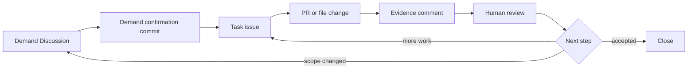

# GitHub Harness Project Starter

[中文](README.md) · [Adoption guide](docs/adoption-guide.md) · [How it works](docs/how-it-works.md) · [Public boundary](docs/public-boundary.md)


This is a **ready-to-deploy project bootstrap that comes with the GitHub Harness kit pre-installed**. Drop the whole directory into the root of any new repository and you immediately get `AGENTS.md`, `.agents/`, `.github/` and the rest of the deployed layout — no need to assemble anything by hand.

Once deployed, AI agents follow this loop: **demand → task → PR / evidence → review → close**. The contents go beyond the Quick Start minimum: you also get workflows, checklists, examples, docs, visual assets, diagrams, source templates, and a backup prompt.

## Workflow at a glance



> An SVG visual of the same loop ships at [`assets/workflow/github-harness-loop.svg`](assets/workflow/github-harness-loop.svg).

## 5-minute Quick Start

### 1. Create a new repository and copy this project in

```bash
# Create an empty repository with GitHub CLI
gh repo create my-new-project --public --add-readme

# Copy the entire project-starter content to the new repo root
cp -R project-starter/. my-new-project/
cd my-new-project
git add . && git commit -m "chore: bootstrap with GitHub Harness starter"
git push
```

> You can also zip `project-starter/` and upload it as a repository initialization template.

### 2. Enable Discussions

Open **Settings → Features** for the repository and enable **Discussions**.

> ⚠️ Discussions must be turned on in the UI; the GitHub API cannot create them.

### 3. Create the "需求确认 / Demand" category

Go to **Discussions → Categories → New category**:

- Name: `需求确认 / Demand`
- Description: Confirm the target user, first-version scope, out-of-scope items, and acceptance standard
- Format: `Discussion` (not Question or Announcement)

### 4. Open your first demand Discussion

Use the [`templates/discussion-demand-confirmation.md`](templates/discussion-demand-confirmation.md) template to capture the target user, first-version scope, acceptance standard, and open questions. End the discussion with a **Demand confirmation commit** section that locks the shared understanding.

### 5. Open the first task issue

From the confirmed demand, use [`templates/task-issue.md`](templates/task-issue.md) to open a single executable, verifiable task issue and assign or claim it.

### 6. Require an evidence comment back from the AI

When the AI finishes the work, it **must** reply on the issue using [`templates/evidence-comment.md`](templates/evidence-comment.md) with:

- What changed
- Where the evidence is
- What was not done
- What risks remain
- Suggested next step: close / continue / split / return to Discussion

### 7. Automation + label set

Three workflows ship under `.github/workflows/` and activate as soon as you push:

| Workflow | Purpose |
|---|---|
| `issue-opened-hint.yml` | New issue gets branch-naming hint; `truth-source` issues get a "frozen, do not claim" notice |
| `pr-merged-close-issue.yml` | PR merged into `main` auto-closes referenced `Closes #` issues; skips `truth-source`; supports Chinese PR body; keeps branches |
| `pr-issue-link-guard.yml` | Soft reminder when a PR has no `Closes/Refs` link (does not block merging) |

Create the following label set under **Issues → Labels** (see [`docs/labels.md`](docs/labels.md) for details):

`prd` · `truth-source` · `parent-task` · `sub-task` · `task` · `phase-a` · `demo` · `frozen`

### 8. Tell the AI to read the project instructions

In an AI agent session, send:

```text
Please read AGENTS.md and .agents/skills/github-harness-workflow/SKILL.md first,
then drive this project through the GitHub Harness workflow.
Do not start implementation until a demand Discussion or a task issue exists.
```

That completes the loop: **demand → task → PR → evidence → review → close**.

## Directory layout

```text
project-starter/
├── AGENTS.md                          # Project-level agent instructions (root)
├── LICENSE                            # MIT
├── README.md                          # This file (Chinese)
├── README.en.md                       # This file (English)
├── .gitignore
├── .agents/                           # Deployed agent skills
│   └── skills/
│       ├── github-harness-workflow/SKILL.md
│       └── github-cognitive-surface-lite/SKILL.md
├── .github/                           # GitHub templates and workflows
│   ├── DISCUSSION_TEMPLATE/
│   ├── ISSUE_TEMPLATE/
│   ├── COMMENT_TEMPLATE/
│   ├── workflows/
│   └── PULL_REQUEST_TEMPLATE.md
├── docs/                              # Reference documentation (7 files)
├── checklists/                        # Acceptance checklists (2 files)
├── workflows/                         # Process walkthroughs (3 files)
├── examples/                          # End-to-end examples (2 files)
├── assets/                            # Brand and workflow visuals (4 SVGs + 2 notes)
├── diagrams/                          # Source diagram (1 Mermaid)
├── templates/                         # Source templates (5 files, for customisation)
└── prompts/                           # Backup prompt (1 file)
```

## What lives where

| Path | Contents and purpose |
|---|---|
| [`AGENTS.md`](AGENTS.md) | Project-level agent instructions. Lives at the repo root so the AI reads it first |
| [`.agents/skills/`](.agents/skills/) | Two skills: `github-harness-workflow` (main loop) + `github-cognitive-surface-lite` (surface expression) |
| [`.github/`](.github/) | Discussion / Issue / Comment templates + 3 automation workflows + PR template |
| [`docs/`](docs/) | 7 reference docs: how it works, adoption guide, surface map, public boundary, verification, labels, review checklist |
| [`checklists/`](checklists/) | 2 acceptance checklists: pre-adoption and public boundary |
| [`workflows/`](workflows/) | 3 process walkthroughs: demand → issue, issue → PR → evidence, review and close |
| [`examples/`](examples/) | 2 end-to-end examples: AI resource index demo and living-loop walkthrough |
| [`assets/`](assets/) | 4 SVGs (logo / banner / social preview / workflow loop) + 2 notes |
| [`diagrams/`](diagrams/) | 1 Mermaid source diagram, renderable on demand |
| [`templates/`](templates/) | 5 source templates, useful as a starting point for further customisation |
| [`prompts/`](prompts/) | 1 backup prompt for scenarios that need more detailed instructions |
| [`LICENSE`](LICENSE) | MIT license |
| [`.gitignore`](.gitignore) | Common ignore rules |

## Internal navigation

| You want to | Jump to |
|---|---|
| See how the loop actually runs | [`docs/how-it-works.md`](docs/how-it-works.md) |
| Adopt this kit into your own project | [`docs/adoption-guide.md`](docs/adoption-guide.md) |
| Learn what Discussion / issue / PR / comment each do | [`docs/surface-map.md`](docs/surface-map.md) |
| Decide which labels to use and when | [`docs/labels.md`](docs/labels.md) |
| Confirm public-boundary requirements before publishing | [`docs/public-boundary.md`](docs/public-boundary.md) |
| Verify the deployment is complete | [`docs/verification.md`](docs/verification.md) |
| See what reviewers should look at | [`docs/review-checklist.md`](docs/review-checklist.md) |
| Tick boxes before adopting | [`checklists/adoption-checklist.md`](checklists/adoption-checklist.md) |
| Tick boxes for public boundary | [`checklists/public-boundary-checklist.md`](checklists/public-boundary-checklist.md) |
| Demand Discussion template | [`.github/DISCUSSION_TEMPLATE/demand-confirmation.md`](.github/DISCUSSION_TEMPLATE/demand-confirmation.md) |
| Task issue template | [`.github/ISSUE_TEMPLATE/task.md`](.github/ISSUE_TEMPLATE/task.md) |
| Parent epic template | [`.github/ISSUE_TEMPLATE/parent-task.md`](.github/ISSUE_TEMPLATE/parent-task.md) |
| Sub-task template | [`.github/ISSUE_TEMPLATE/sub-task.md`](.github/ISSUE_TEMPLATE/sub-task.md) |
| Truth-source template (frozen) | [`.github/ISSUE_TEMPLATE/truth-source.md`](.github/ISSUE_TEMPLATE/truth-source.md) |
| Kit feedback template | [`.github/ISSUE_TEMPLATE/kit-feedback.md`](.github/ISSUE_TEMPLATE/kit-feedback.md) |
| Evidence comment template | [`.github/COMMENT_TEMPLATE/evidence-comment.md`](.github/COMMENT_TEMPLATE/evidence-comment.md) |
| Completion comment template | [`.github/COMMENT_TEMPLATE/completion-comment.md`](.github/COMMENT_TEMPLATE/completion-comment.md) |
| Exploration comment template | [`.github/COMMENT_TEMPLATE/exploration-comment.md`](.github/COMMENT_TEMPLATE/exploration-comment.md) |
| Process: demand → issue | [`workflows/demand-discussion-to-issue.md`](workflows/demand-discussion-to-issue.md) |
| Process: issue → PR → evidence | [`workflows/issue-to-pr-to-evidence.md`](workflows/issue-to-pr-to-evidence.md) |
| Process: review and close | [`workflows/review-and-close-loop.md`](workflows/review-and-close-loop.md) |
| End-to-end demo | [`examples/ai-resource-index-harness-demo.md`](examples/ai-resource-index-harness-demo.md) |
| Living-loop walkthrough | [`examples/living-loop-walkthrough.md`](examples/living-loop-walkthrough.md) |
| Backup prompt | [`prompts/project-harness-instructions.md`](prompts/project-harness-instructions.md) |
| Source diagram (Mermaid) | [`diagrams/minimum-harness-engine.mmd`](diagrams/minimum-harness-engine.mmd) |
| Workflow SVG | [`assets/workflow/github-harness-loop.svg`](assets/workflow/github-harness-loop.svg) |
| Brand SVGs | [`assets/brand/`](assets/brand/) |
| Assets overview | [`assets/README.md`](assets/README.md) |

## Things to keep in mind

- This project is a **deployed** bootstrap, not the source repository of the kit itself. The `templates/` and `prompts/` directories hold reference copies for further customisation.
- After copying it into a new repository, immediately rewrite the project name, target user, and scope in `AGENTS.md` to fit your project.
- The workflows in `.github/workflows/` depend on branch protection; make sure `main` requires PR review.
- Discussion categories must be created in the UI; the API cannot create them.
- Items labelled `truth-source` are skipped by the merge-closing logic and never auto-closed.

## License and notes

This project is released under the MIT license, see [`LICENSE`](LICENSE).

It is a deployed-shape bootstrap that is more complete than the Quick Start minimum and is meant to be the starting point for any new project that wants the GitHub Harness loop out of the box.
