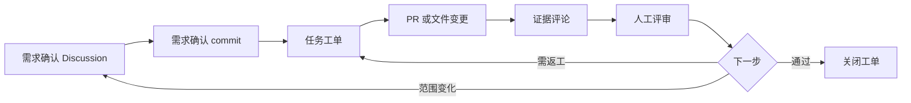

# GitHub Harness 项目起始模板

[English](README.en.md) · [采用指南](docs/adoption-guide.md) · [工作流说明](docs/how-it-works.md) · [公开边界](docs/public-boundary.md)


这是一个**已经部署好 GitHub Harness 套件的项目初始版本**。把整个目录拷到任意新仓库的根目录,`AGENTS.md`、`.agents/`、`.github/` 等部署结构就位,可直接投入使用,无需再手动拼装。

部署后,AI agent 会按 `需求确认 → 任务工单 → PR / 证据评论 → 评审 → 关闭` 的方式推进项目。所有内容比 Quick Start 最小集更完整:包含 workflow、checklist、example、文档、视觉资产、图表、源模板、备用 prompt。

## 工作流一览



> 上图对应的 SVG 视觉版本见 [`assets/workflow/github-harness-loop.svg`](assets/workflow/github-harness-loop.svg)。

## 5 分钟 Quick Start

### 1. 创建新仓库并拷入本项目内容

```bash
# 用 GitHub CLI 创建空仓库
gh repo create my-new-project --public --add-readme

# 把本项目全部内容拷到新仓库根目录
cp -R project-starter/. my-new-project/
cd my-new-project
git add . && git commit -m "chore: bootstrap with GitHub Harness starter"
git push
```

> 也可以直接把 `project-starter/` 内容 zip 化,作为仓库初始化模板上传。

### 2. 启用 Discussions

进入仓库 **Settings → Features**,勾选 **Discussions**。

> ⚠️ Discussions 必须在 UI 开启,GitHub API 无法代为创建。

### 3. 建立分类"需求确认 / Demand"

在 Discussions 页面 → **Categories → New category**:

- 名称:`需求确认 / Demand`
- 描述:把需求、目标用户、范围、不做什么、验收标准聊清楚
- 格式:`Discussion`(非 Question / Announcement)

### 4. 开第一条需求确认 Discussion

使用 [`templates/discussion-demand-confirmation.md`](templates/discussion-demand-confirmation.md) 模板,把目标用户、首版范围、验收标准、开放问题写清楚。Discussion 结尾让 AI 写出 **Demand confirmation commit** 段,把共识固定下来。

### 5. 拆出第一个 Task 工单

依据需求确认,使用 [`templates/task-issue.md`](templates/task-issue.md) 创建一条可执行、可验收的任务工单,指派或声明领取。

### 6. 要求 AI 用证据评论回写

AI 完成任务后,**必须**使用 [`templates/evidence-comment.md`](templates/evidence-comment.md) 在工单下回写:

- 改了什么
- 证据在哪里
- 哪些没做
- 风险是什么
- 下一步建议:close / continue / split / return to Discussion

### 7. 自动化 + 标签集

`.github/workflows/` 已包含 3 个工作流,合 PR 时自动联动:

| Workflow | 作用 |
|---|---|
| `issue-opened-hint.yml` | issue 一开就贴分支命名提示;`truth-source` 贴"冻结勿领取" |
| `pr-merged-close-issue.yml` | PR 合 main 自动 close `Closes #` 引用的 issue;`truth-source` 守护不误关;中文 PR body 兼容 |
| `pr-issue-link-guard.yml` | PR 缺 `Closes/Refs` 软提醒(不阻断合并) |

请到仓库 **Issues → Labels** 创建以下标签集,详情见 [`docs/labels.md`](docs/labels.md):

`prd` · `truth-source` · `parent-task` · `sub-task` · `task` · `phase-a` · `demo` · `frozen`

### 8. 让 AI 读取项目说明

在 AI agent 会话中发送:

```text
请先阅读 AGENTS.md 与 .agents/skills/github-harness-workflow/SKILL.md,
再按 GitHub Harness 工作流推进本项目。
在出现需求确认 Discussion 或任务工单之前,不要直接开始实现。
```

到此,完整闭环已经跑通:**demand → task → PR → evidence → review → close**。

## 目录结构

```text
project-starter/
├── AGENTS.md                          # 项目级 Agent 说明(根目录直接放)
├── LICENSE                            # MIT
├── README.md                          # 本文件(中文)
├── README.en.md                       # 英文版
├── .gitignore
├── .agents/                           # Agent skills 部署位置
│   └── skills/
│       ├── github-harness-workflow/SKILL.md
│       └── github-cognitive-surface-lite/SKILL.md
├── .github/                           # GitHub 模板与 workflow
│   ├── DISCUSSION_TEMPLATE/
│   ├── ISSUE_TEMPLATE/
│   ├── COMMENT_TEMPLATE/
│   ├── workflows/
│   └── PULL_REQUEST_TEMPLATE.md
├── docs/                              # 参考文档(7 份)
├── checklists/                        # 验收检查(2 份)
├── workflows/                         # 流程说明(3 份)
├── examples/                          # 端到端示例(2 份)
├── assets/                            # 品牌与流程视觉(4 SVG + 2 说明)
├── diagrams/                          # 源图表(1 份 Mermaid)
├── templates/                         # 源模板(5 份,供自定义)
└── prompts/                           # 备用 prompt(1 份)
```

## 目录与文件作用

| 路径 | 内容与作用 |
|---|---|
| [`AGENTS.md`](AGENTS.md) | 项目级 Agent instructions。根目录直接放,AI agent 启动时会优先阅读 |
| [`.agents/skills/`](.agents/skills/) | 两份 Skill:`github-harness-workflow`(主流程)+ `github-cognitive-surface-lite`(表面表达) |
| [`.github/`](.github/) | Discussion / Issue / Comment 模板 + 3 个自动化 workflow + PR 模板 |
| [`docs/`](docs/) | 7 份参考文档:工作机制、采用指南、表面分工、公开边界、验证记录、标签说明、review checklist |
| [`checklists/`](checklists/) | 2 份验收清单:采用前自检、公开边界自检 |
| [`workflows/`](workflows/) | 3 份流程说明:需求讨论转工单、工单转 PR 转证据、评审与关闭 |
| [`examples/`](examples/) | 2 份端到端示例:AI 资源索引 demo、活体闭环 walkthrough |
| [`assets/`](assets/) | 4 份 SVG(logo / banner / social preview / 流程图)+ 2 份说明文件 |
| [`diagrams/`](diagrams/) | 1 份 Mermaid 源图,可自行渲染 |
| [`templates/`](templates/) | 5 份源模板,可作为进一步自定义的起点 |
| [`prompts/`](prompts/) | 1 份备用 prompt,适合需要更详细指令的场景 |
| [`LICENSE`](LICENSE) | MIT 许可证 |
| [`.gitignore`](.gitignore) | 通用忽略规则 |

## 内部分类导航

| 想看的内容 | 跳到 |
|---|---|
| 这套机制是怎么跑起来的 | [`docs/how-it-works.md`](docs/how-it-works.md) |
| 怎么把它用到我的新项目 | [`docs/adoption-guide.md`](docs/adoption-guide.md) |
| Discussion / issue / PR / comment 各自负责什么 | [`docs/surface-map.md`](docs/surface-map.md) |
| 标签怎么打、什么时候打 | [`docs/labels.md`](docs/labels.md) |
| 公开前需要确认什么边界 | [`docs/public-boundary.md`](docs/public-boundary.md) |
| 怎样验证部署没有遗漏 | [`docs/verification.md`](docs/verification.md) |
| 评审要看哪些项 | [`docs/review-checklist.md`](docs/review-checklist.md) |
| 采用前要打勾的清单 | [`checklists/adoption-checklist.md`](checklists/adoption-checklist.md) |
| 公开边界要打勾的清单 | [`checklists/public-boundary-checklist.md`](checklists/public-boundary-checklist.md) |
| 需求确认 Discussion 模板 | [`.github/DISCUSSION_TEMPLATE/demand-confirmation.md`](.github/DISCUSSION_TEMPLATE/demand-confirmation.md) |
| 任务工单模板 | [`.github/ISSUE_TEMPLATE/task.md`](.github/ISSUE_TEMPLATE/task.md) |
| 父 Epic 模板 | [`.github/ISSUE_TEMPLATE/parent-task.md`](.github/ISSUE_TEMPLATE/parent-task.md) |
| 子任务模板 | [`.github/ISSUE_TEMPLATE/sub-task.md`](.github/ISSUE_TEMPLATE/sub-task.md) |
| 真理源模板(冻结) | [`.github/ISSUE_TEMPLATE/truth-source.md`](.github/ISSUE_TEMPLATE/truth-source.md) |
| 套件反馈模板 | [`.github/ISSUE_TEMPLATE/kit-feedback.md`](.github/ISSUE_TEMPLATE/kit-feedback.md) |
| 证据评论模板 | [`.github/COMMENT_TEMPLATE/evidence-comment.md`](.github/COMMENT_TEMPLATE/evidence-comment.md) |
| 完成评论模板 | [`.github/COMMENT_TEMPLATE/completion-comment.md`](.github/COMMENT_TEMPLATE/completion-comment.md) |
| 探索评论模板 | [`.github/COMMENT_TEMPLATE/exploration-comment.md`](.github/COMMENT_TEMPLATE/exploration-comment.md) |
| 流程说明:需求→工单 | [`workflows/demand-discussion-to-issue.md`](workflows/demand-discussion-to-issue.md) |
| 流程说明:工单→PR→证据 | [`workflows/issue-to-pr-to-evidence.md`](workflows/issue-to-pr-to-evidence.md) |
| 流程说明:评审与关闭 | [`workflows/review-and-close-loop.md`](workflows/review-and-close-loop.md) |
| 端到端 demo | [`examples/ai-resource-index-harness-demo.md`](examples/ai-resource-index-harness-demo.md) |
| 活体闭环示例 | [`examples/living-loop-walkthrough.md`](examples/living-loop-walkthrough.md) |
| 备用 prompt | [`prompts/project-harness-instructions.md`](prompts/project-harness-instructions.md) |
| 源图表(Mermaid) | [`diagrams/minimum-harness-engine.mmd`](diagrams/minimum-harness-engine.mmd) |
| 流程 SVG | [`assets/workflow/github-harness-loop.svg`](assets/workflow/github-harness-loop.svg) |
| 品牌 SVG | [`assets/brand/`](assets/brand/) |
| 资产说明 | [`assets/README.md`](assets/README.md) |

## 注意事项

- 本项目是**已部署形态**的初始模板,不是套件本身的源码仓库。所有 `templates/`、`prompts/` 下的源文件仅作为进一步自定义的参考副本。
- 复制到新仓库后,建议立刻把 `AGENTS.md` 中的项目名、目标用户、范围改写为自己的版本。
- `.github/workflows/` 中的工作流对分支保护规则有依赖,请确保 `main` 分支已开启 PR review。
- Discussions 的 category 必须在 UI 内建立,API 不支持创建。
- 真理源(`truth-source` 标签)条目会被合并守护逻辑跳过,不会被自动关闭。

## 许可与说明

本项目自身以 MIT 协议发布,见 [`LICENSE`](LICENSE)。

本项目由部署型初始模板组成,内容比 Quick Start 最小集更完整,适合作为新项目的开局;不需要再从零拼装 GitHub Harness 套件。
